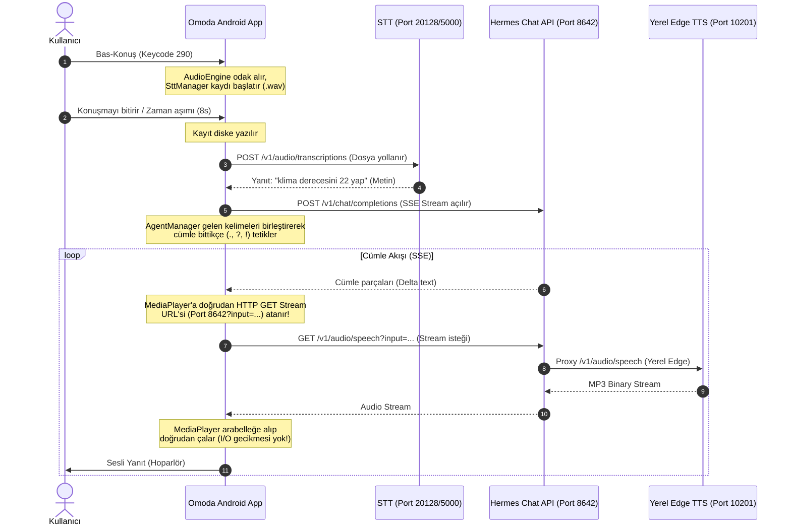

# AGENTS.md - Bilgi Çıkarma Protokolü

Bu dosya, projedeki otonom ajanların çalışma prensiplerini ve bilgi yönetim protokollerini tanımlar.

## Bilgi Çıkarma Protokolü

0.  **Dil Kuralı:** Kod yazımı haricindeki tüm iletişim, raporlama ve dokümantasyon güncellemeleri KESİNLİKLE Türkçe yapılacaktır.
1.  **Bağlantı Sorunları Protokolü:** Hermes veya MQTT bağlantı sorunu yaşandığında:
    *   **Önce Sunucu Kontrolü:** Sunucunun (192.168.1.14) erişilebilirliği ve servislerin (8642, 1883 vb.) durumu kontrol edilmeden KESİNLİKLE kod değişikliği yapılmaz.
    *   **Kod Kontrolü:** Sunucu normalse, uygulamadaki **3 kırmızı LED** (Bağlantı durum göstergeleri) üzerinden hata analizi yapılır.
2.  **Sürüm/Versiyon Doğrulama Kuralı:** Ajanlar, cihaza her bağlandığında (ADB veya diğer yollarla) ve test/analiz aşamasına geçmeden ÖNCE mutlaka cihazdaki aktif uygulamanın versiyonunu (`dumpsys package` veya loglar aracılığıyla) kontrol edecektir. Eski sürüm çalışıyorken kod değişikliği yapmak veya hata aramak KESİNLİKLE YASAKTIR.
3.  **Gözlem:** Her kullanıcı isteğinde ve kod incelemesinde yeni bilgiler (teknik kısıtlar, tercihler, kararlar) aranır.
3.  **Kayıt:** Yeni bir teknik karar, kısıt veya bilgi tespit edildiğinde, kullanıcıya sormadan direkt olarak sistemin yapı taşı olan ilgili dokümana (örneğin tasarım için `UI_MANIFESTO.md`, genel kurallar için `PROJECT_BRIEF.md`) eklenir.
4.  **Otonom İş Akışı (Auto-Fix & Deploy):** SADECE ufak syntax veya derleme hataları için "EVET" onayı bekleme kuralı kaldırılmıştır. Ajan, ufak hataları tespit ettiğinde otomatik düzeltir, derler, yükler. ANCAK BÜYÜK MİMARİ DEĞİŞİKLİKLER İÇİN BU KURAL GEÇERLİ DEĞİLDİR.
5.  **Doğrulama:** Eğer yeni bilgi mevcut kararlarla çelişiyorsa, işlem yapmadan önce kullanıcıdan onay istenir.
6.  **Analiz ve Ezbere Düzenleme Yasağı (KRİTİK):** Her işlem veya düzenleme adımından önce ve sonra mutlaka detaylı durum analizi yapılacaktır. Ajanlar kesinlikle ezbere kod editlemeyecek; mevcut kodu, alınan sistem izinlerini ve bağımlılıkları derinlemesine incelemeden "Ben böyle yapardım" deyip kod yapısını DEĞİŞTİREMEZ.
7.  **Mimari Değişiklik ve Hack Yasağı (MUTLAK KURAL):** Bir API veya komut (örn. dumpsys) çalışmadığında veya sorun çıkardığında, ajan KESİNLİKLE ana mimariyi terk edip logcat okumak (log parsing) gibi "çöp karıştırma" veya geçici hack yöntemlerine otonom olarak geçemez. Sorun çözülürken, öncelikle mevcut sistemin ve izinlerin neden başarısız olduğu analiz edilecek ve KULLANICIDAN AÇIKÇA ONAY ALINMADAN alternatif/hack yöntemler uygulanmayacaktır.
8.  **Dokümantasyon Güncelleme Kuralı:** Ajanlar her görev tamamlandığında aşağıdaki dosyaları mutlaka güncellemeli ve senkronize etmelidir:
    *   `PROGRESS.md`: Yapılan son geliştirmenin, sürüm numarasının ve çözülen hataların kronolojik günlüğü.
    *   `ROADMAP.md`: Projedeki ana hedeflerin tamamlanma durumu (Checkbox güncellemeleri).
    *   `FILE_INDEX.md`: Değişen veya yeni eklenen dosyaların amacına dair endeks kaydı.
    *   `UI_MANIFESTO.md`: Yeni alınan veya değişen tasarımsal kısıtlar (Padding, ekran oranları vb.).
    *   `PROJECT_BRIEF.md` & `SISTEM_CALISMA_MANTIGI.md`: Yeni bir port, dış servis, veya veri akışı (Event) kurgulandığında, bu mimari tasarım dosyaları derhal revize edilmelidir. Sistemdeki "Proje Mimari Haritası" terimi bu iki dosyayı ifade eder.

## Mimari Kısıtlar (ÖNEMLİ)

*   **EventBus Kuralı (No Polling Dependency):** Sistemdeki UI bileşenleri verileri ASLA kaynak koddan veya VehicleController'dan polling (saniyede bir sorma) yöntemiyle çekmeyecektir. Tüm veriler doğrudan tasarımdaki reaktif yapısına uygun olarak `EventBus` veya `GlobalState` akışlarından toplanacak (collect).
*   **Güvenlik Anahtarı Kuralı:** Simülasyon verisi, tüm uygulama içerisinde tek bir global anahtara (`GlobalState.isSimulationMode.value`) bağlı olmalıdır. MQTT simülatöründen gelen veri bu kilit kapalıyken asla EventBus'a veya içeriye enjekte edilemez.
*   **ActivityView Kısıtı (Kritik Donanım Koruması):** `ActivityView` veya `SurfaceView` barındıran bileşenleri (örn. Harita) arka planda gizlemek için ASLA `Modifier.offset(10000.dp)` veya aşırı büyük koordinat değerleri kullanılamaz. Bu durum `SurfaceFlinger` bellek taşmasına ve cihazın Soft-Brick olmasına (Siyah ekran çökmesine) yol açar. Gizlemek için `Modifier.alpha(0f)` ve z-index veya `graphicsLayer(scaleX=0.001f, scaleY=0.001f)` kullanılmalıdır.
*   **Arayüz (UI) Kontrol Kuralı:** Bir sistem katmanı veya veri editi yapıldığında (özellikle EventBus entegrasyonlarında), bu değişikliğin doğrudan UI'ye yansıyıp yansımadığı kesinlikle kontrol edilip, ekranın reaksiyon vermeme riski eksik bırakılmayacaktır.
*   **Sabit Katman Mimarisi Kuralı:** Sistem; Hardware/VHAL, Yürütme/ADB, Reaktif Merkez/EventBus, Telemetri/MQTT, Yapay Zeka/Hermes, UI/Overlay ve PC Simülasyon olmak üzere 7 sabit katmandan oluşur. Tüm yeni revizyonlar ve özellikler KESİNLİKLE bu katmanlardan birine entegre edilecektir. Sisteme yeni bir mimari katman eklenmesi YASAKTIR. (Architecture 2.0 ile bu katmanlar DSL üzerinden yönetilmektedir).

*   **UI & SES Koruma:** Ana ekran 5x2 grid yapısı, 235dp sidebar boşluğu ve 16kHz Mono ses kayıt standartları `UI_MANIFESTO.md` kurallarına göre korunmalıdır. Değiştirilemez.
*   **Tek IP / Çoklu Port Mimarisi:** Projede tüm dış servisler TEK BİR IP adresi üzerinden sunulur. Farklı hizmetler sadece port numaraları ile ayırt edilir.
*   **Sabit Sunucu Adresi:** `100.95.239.119` (Tailscale) / `192.168.1.14` (Yerel Ağ)
*   **Doğrulanmış Servis ve Yetki Haritası (04.07.2026 Test Sonucu):**
    *   **Hermes API (8642):** 
        *   Görev: Chat Completions (SSE), Session yönetimi.
        *   Durum: **AKTİF** (200 OK)
        *   API Key: `cdc682fdab57893c833680246ca0b95635c2c479e612218918d5e4bdbddc8e34` (Primary)
    *   **Hermes WebSocket Relay (8766):**
        *   Görev: Bridge sunucusu ile Hermes arasında çift yönlü komut/yanıt WebSocket kanalı.
        *   Durum: **AKTİF VE ONARILDI** (13.07.2026'da servis kapalı bulundu, manuel restart edildi)
        *   Not: `POST /relay/send` ile WS client'ına komut gönderilebilir.
    *   **BridgeServer (8765):**
        *   Görev: Cihaz üzerinde çalışan yerel HTTP API sunucusu (ActionExecutor komutları).
        *   Durum: **AKTİF** (BridgeServer.start)
    *   **9Router API (20128):** 
        *   Görev: STT (Whisper) ve TTS (OpenAI/Piper) proxy servisi.
        *   Durum: **AKTİF** (200 OK)
        *   API Key: `sk-b6f4d3879cc4a442-vwd4xl-8ad79a58` (Secondary/Fallback)
    *   **Wyoming/Bridge (5000):**
        *   Görev: 9Router veya Hermes başarısız olduğunda devreye giren otomatik yerel STT/TTS köprüsü.
        *   Durum: **AKTİF VE DÜZELTİLDİ** (wyoming-bridge.service — systemd, port 5000 dinliyor)
        *   Protokol: OpenAI-Compatible HTTP over port 5000.
        *   Not: STT → 9Router proxy, TTS → edge-tts (yerel)
    *   **Edge TTS (10201):**
        *   Görev: TTS (Edge TTS) HTTP sunucusu.
        *   Durum: **AKTİF** (edge-tts-server.service — systemd)
        *   Not: API key gerektirmez, `POST /v1/audio/speech`
    *   **Sherpa STT (5002):**
        *   Görev: Çevrimdışı (Yerel) Türkçe ASR (Whisper Tiny int8).
        *   Durum: **AKTİF** (sherpa-stt.service — systemd, port 5002 dinliyor)
        *   Not: Wyoming Bridge (Port 5000) rate limit veya 9Router hatası aldığında otomatik olarak bu servise yedek kanal (failover) olarak düşer.
    *   **MQTT (1883):** Telemetri.
*   **GitHub OTA Yapılandırması:**
    *   Token: `AssistantApplication.GITHUB_TOKEN` (Hardcoded fallback + ConfigManager override)
    *   Kullanım: Sürüm kontrolü ve APK indirme süreçlerinde yetkilendirme sağlar.
    *   Yönetim: Token, `AppConfig.githubToken` alanı üzerinden `app_config.json`'a yazılır. Config dosyasında yoksa hardcoded varsayılan kullanılır.
*   **Paket Boyutu ve Güncelleme Politikası (Kritik):**
    *   Derleme ve yükleme süreçlerinde her zaman APK boyutunu küçük tutmaya (modelleri dışarıda bırakan hafif "Update" paketi: `app/build.gradle` içindeki `isUpdateOnly = true`) ve güncellemeleri bu hafif paket üzerinden kurmaya özen gösterilmelidir.
    *   Full paket (`app-fullV*.apk`) yalnızca modellerin ilk kurulumu veya modellerin güncellenmesi gereken önemli ve major durumlarda tercih edilmelidir. Cihazda modeller zaten yüklü ise her zaman update paketi derlenip yüklenmelidir.
*   **Sunucu SSH Erişimi:**
    *   Host: `192.168.1.14`
    *   User: `dietpi` (40781)
    *   Password: `40781`
*   **Servis Kısıtlamaları:** Groq veya diğer harici doğrudan bulut API'leri KESİNLİKLE kullanılmayacaktır. Tüm yapay zeka ve ses işlemleri `100.95.239.119:8642` ve diğer yerel portlar üzerinden yürütülecektir. TTS olarak yalnızca yerel Edge TTS sunucusu (Port `10201`) kullanılacaktır.
*   **Linux/Tkinter UI Kısıtlamaları (VHAL AES):** Python CustomTkinter kütüphanesinde (main.py vb.) font ağırlığı olarak KESİNLİKLE `weight="black"` KULLANILMAMALIDIR. Linux X11 ortamı bunu desteklemediğinden `_tkinter.TclError` ile uygulamanın çökmesine neden olur. Yalnızca `weight="bold"` veya `weight="normal"` kullanılacaktır.

## Kod İnceleme Protokolü

Bir dosya "kontrol et" dendiğinde aşağıdaki adımlar sırasıyla uygulanır:

1.  **Doğrudan Okuma:** Hedef dosya baştan sona okunur, tüm fonksiyonların mantığı analiz edilir.
2.  **Cross-Reference Taraması:** Dosyadaki import'lar ve referans verilen semboller (`instance`, `static` çağrılar) grep ile proje genelinde taranır. İlgili tüm dosyalar okunur.
3.  **Döküman Uyumluluğu:** AGENTS.md, PROJECT_BRIEF.md ve ROADMAP.md'deki teknik kısıtlar (port numaraları, IP adresleri, servis tanımları) kodla karşılaştırılır. Tutarsızlık varsa raporlanır.
4.  **Bağımlılık Zinciri Analizi:** Dosyanın çağırdığı ve çağrıldığı tüm noktalar belirlenir, eksik/hatalı bağlantılar tespit edilir.
5.  **Bug/Kaçak Taraması:**
    *   Her callback/invoke yolunda kaynak yönetimi (foreground notification, scope iptali, WebSocket kapatma) kontrol edilir.
    *   Null-safety: `?.` kullanılmayan nullable çağrılar taranır.
    *   Lifecycle: Coroutine scope'ların iptal edilme senaryoları gözden geçirilir.
    *   Race condition: Birden çok callback'in aynı anda tetiklenme olasılığı değerlendirilir.
6.  **Raporlama:** Bulgular öncelik sırasına göre (BUG / UYUMSUZLUK / DÜŞÜK RİSK) etiketlenerek sunulur.

## Kapsamlı Kod Audit Raporu

Tüm proje kaynak kodunun profesyonel gözle taramasının sonucu [CODE_AUDIT_REPORT.md](CODE_AUDIT_REPORT.md) dosyasında tutulur. Bu rapor aşağıdaki kategorileri kapsar:

- **Güvenlik:** Export edilmiş korumasız servis/receiver'lar, komut enjeksiyonu, hardcoded API key'leri
- **Ağ/Bağlantı:** Socket resource leak'leri, timeout ayarları, yeniden bağlanma mekanizmaları, fallback zincirleri
- **Ses (STT/TTS):** Race condition'lar, AudioRecord/MediaPlayer sızıntıları, onError→onComplete yanlış çağrısı
- **Durum Yönetimi:** Çift durum tanımları, ölü UI akışları, config kaydetme/revert eksiklikleri
- **Kaynak Yönetimi:** Coroutine scope sızıntıları, WakeLock zaman aşımı eksikliği, ham Thread sızıntıları
- **Ölü Kod:** Kullanılmayan dosyalar, boş fonksiyon gövdeleri, kullanılmayan değişkenler
- **Mimari:** God Object, duplicate ViewModel, reflection bağımlılıkları

**Ajanlar yeni bir görev alduğunda bu raporu referans almalı, düzeltme yapılacaksa öncelik sırasına (Kritik → Yüksek → Orta → Düşük) uymalıdır.**

## API Hata Ayıklama Protokolü

*   **Sorun Tespiti:** Bağlantı veya yapılandırma sorunu yaşanırsa, doğrudan uygulamanın ana kodlarını bozarak deneme-yanılma yapmak **KESİNLİKLE YASAKTIR!**
*   **Test Araçlarının Kullanımı:** Ajanlar, API arızalarında öncelikle `scripts/` dizininde bulunan yerel test aracı olan [test_voice_system.py](file:///mnt/depo/launcher_v2/scripts/test_voice_system.py) betiğini kullanmalıdır.

### Servis Canlılık Testi

1. **Ping:** `ping -c 2 -W 3 <ip>`
2. **Ses Sistemi Testi:** `python3 scripts/test_voice_system.py --ip <ip>` (Wyoming/9Router/EdgeTTS/Hermes test eder)
3. **Servis Kontrolü:** `python3 scripts/check_services.py` (9Router API port 20128 test eder)
4. **Simülasyon Verisi Gönderimi:** `python3 scripts/send_sim_data.py` (MQTT üzerinden sahte telemetri basar)

## Test Araçları Kataloğu

Emin olunmayan durumlarda aşağıdaki script'ler doğrulama için KESİNLİKLE kullanılmalıdır:

| Araç | Konum | Açıklama |
| :--- | :--- | :--- |
| **Ses Sistemi Testi** | `scripts/test_voice_system.py` | STT, TTS ve LLM servislerini uçtan uca test eder. En kapsamlı test aracıdır. |
| **Simülasyon Veri Basıcı** | `scripts/send_sim_data.py` | MQTT `omoda/simulate` kanalına sahte Hız, RPM, Vites verisi gönderir. |
| **API Servis Kontrolü** | `scripts/check_services.py` | 9Router (Port 20128) üzerinden STT, Chat ve TTS fonksiyonlarını test eder. |
| **Oturum Yönetimi Testi** | `scripts/test_sessions.py` | Hermes API (Port 8642) oturum oluşturma ve SSE stream chat testlerini yapar. |
| **Edge TTS WS Test** | `aes_app/test_edge_ws.py` | Microsoft Edge TTS WebSocket bağlantısını ve token üretimini doğrular. |
| **Bridge API Test** | `scripts/test_bridge_api.py` | Wyoming/Bridge (Port 5000) katmanını test eder. |

## Overlay Uç Noktası

Overlay, sesli yanıtı iki kez gösteriyordu (üstte gri + altta mavi metin). Çözüm: `AssistantOverlayUI` içinde yalnızca tek metin görünmesi sağlandı.

## Ses İletim Mimarisi ve Yol Haritası

### Ses İletim Adımları

1. **Sesin Alınması (STT):** Kullanıcı bas-konuş yaptığında ses `.wav` dosyası olarak kaydedilir ve `http://192.168.1.14:20128/v1/audio/transcriptions` (Yedek: `http://192.168.1.14:5000/v1/stt`) adresi üzerinden metne dönüştürülür.
2. **AI İşleme (Hermes Chat completions SSE):** Çözümlenen metin `http://192.168.1.14:8642/v1/chat/completions` OpenAI-compatible endpoint'ine gönderilir. Kelimeler SSE stream olarak geri akar. Cümle bitişlerinde (`.`, `?`, `!`) veya 50 karakter sınırında sentezleme sıraya alınır.
3. **Ses Sentezleme (HTTP GET Stream):** Bölünen cümleler diske yazılmaksızın doğrudan MediaPlayer'a stream URL'si olarak yollanır. MediaPlayer, `http://${serverIp}:8642/v1/audio/speech?input=...&voice=edge` adresi üzerinden ses akışını (GET) alır. Hermes API bu isteği yerel Edge TTS sunucusuna (Port 10201) proxy eder ve dönen MP3 binary akışı MediaPlayer tarafından arabelleğe alınarak anında hoparlörden çalınır. (I/O yazma gecikmesi tamamen engellenmiştir).

## graphify

This project has a knowledge graph at graphify-out/ with god nodes, community structure, and cross-file relationships.

When the user types `/graphify`, use the installed graphify skill or instructions before doing anything else.

Rules:
- For codebase questions, first run `graphify query "<question>"` when graphify-out/graph.json exists. Use `graphify path "<A>" "<B>"` for relationships and `graphify explain "<concept>"` for focused concepts. These return a scoped subgraph, usually much smaller than GRAPH_REPORT.md or raw grep output.
- Dirty graphify-out/ files are expected after hooks or incremental updates; dirty graph files are not a reason to skip graphify. Only skip graphify if the task is about stale or incorrect graph output, or the user explicitly says not to use it.
- If graphify-out/wiki/index.md exists, use it for broad navigation instead of raw source browsing.
- Read graphify-out/GRAPH_REPORT.md only for broad architecture review or when query/path/explain do not surface enough context.
- After modifying code, run `graphify update .` to keep the graph current (AST-only, no API cost).