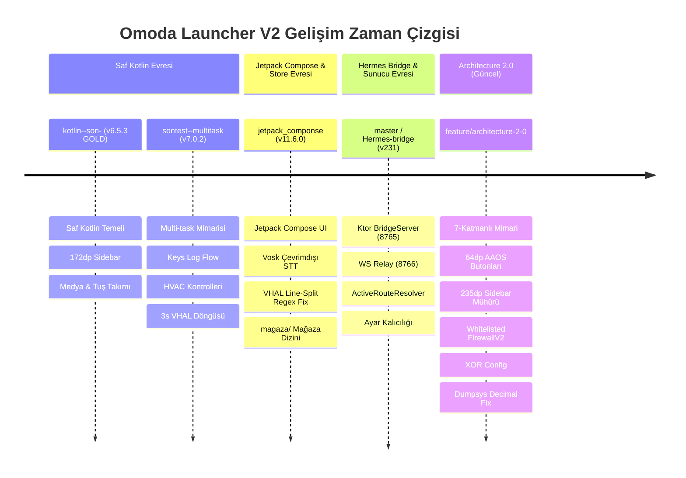

# OMODA UNIVERSAL ASSISTANT V2 - MASTER TEKNİK ANSİKLOPEDİ VE REHBER 📘

Bu doküman; Omoda 5 Android Automotive OS (AAOS 10) ve Mobil Çift Platformlu AI Asistan projesinin tüm mimarisini, veri akışlarını, geçmiş dallardaki evrim sürecini, kesinleşmiş bug çözümlerini ("Don't Do" listesi) ve geliştirme standartlarını içeren **resmi Master teknik kitabıdır**. Aynı zamanda otonom AI ajanlarının projeye katıldıklarında context yükünü minimize eden ve hızlı aksiyon almalarını sağlayan **ana kılavuzdur**.

---

## KİMLİK VE BAĞLAM KARTI 🎴

| Parametre | Değer |
| :--- | :--- |
| **Proje Adı** | Omoda Universal Assistant V2 (Launcher V2) |
| **Hedef Platform** | Android Automotive OS (AAOS 10 / API 29) + Mobil Test Modu |
| **Aktif Dal** | `feature/architecture-2-0` |
| **Mevcut Sürüm** | (Gradle Version) |
| **Doküman Sürümü** | `4.2.1` (Master Ansiklopedi - Multi-Key Indexing Onayı) |
| **Son Güncelleme** | 23.07.2026 |
| **Ana Sunucu IP** | `192.168.1.14` (Yerel Ağ) |
| **Mimarisi** | Architecture 2.0 (7-Katmanlı Event-Driven Reaktif Yapı) |

---

## 1. MİMARİ ZAMAN ÇİZELGESİ VE DALLARIN EVRİMİ 📜

Proje bugüne kadar farklı dallarda belirli kilometre taşlarından geçerek bugünkü `feature/architecture-2-0` yapısına ulaşmıştır:



### Dal Detayları ve Kazanımlar:
1. **`kotlin--son-` (v6.5.3 GOLD):**
   - Saf Kotlin tabanlı ilk stabil sürüm. Medya ve direksiyon tuş takımı (`HardKeyPressed`) entegrasyonu sağlandı.
2. **`sontest--multitask` (v7.0.2-NextGen-V60):**
   - Eşzamanlı arka plan görevleri (Multi-task), iklimlendirme (HVAC) kontrolleri ve 3 saniyelik araç telemetri yayın döngüsü kuruldu.
3. **`jetpack_componse` (v11.6.0):**
   - Tüm arayüz Jetpack Compose mimarisine taşındı. Vosk çevrimdışı ses modeli entegre edildi. VHAL line-split regex hataları çözüldü. Kök dizindeki `magaza/` klasörü üzerinden 3. parti APK dağıtımı (Aptoide, SmartTube vb.) başlatıldı.
4. **`master` / `Hermes-bridge` (v231):**
   - Ktor tabanlı yerel `BridgeServer` (Port 8765) ve WebSocket Relay (Port 8766) kuruldu. Tailscale ve yerel IP arasında otomatik geçiş yapan `ActiveRouteResolver` geliştirildi. Ayarların kalıcı saklanması sağlandı.
5. **`feature/architecture-2-0` (v6447 - Mevcut Ana Dal):**
   - 7 katmanlı reaktif mimariye geçildi. AAOS Distraction Guidelines (Min 64dp Touch Target, `CarButton`, `CarIconButton`) zorunlu kılındı. Sidebar genişliği **235dp** olarak mühürlendi. `CommandFirewallV2` whitelisting ve ekrana şeffaf uyarı yansıtma mekanizması eklendi. `dumpsys` decimal `.toLong(16)` dönüşümü sağlandı.

---

## 2. ARCHITECTURE 2.0: 7 TEMEL MİMARİ KATMAN 🛠️

Proje, modülerliği ve ölçeklenebilirliği korumak adına 7 katmana ayrılmıştır:

```
[Katman 1: VHAL] ──► [Katman 2: Execution/ADB] ──► [Katman 3: Reaktif Merkez/EventBus]
                                                          │
   ┌──────────────────────────────────────────────────────┴──────────────────────────────────────────────────────┐
   ▼                                                      ▼                                                      ▼
[Katman 4: Telemetri/MQTT]                     [Katman 5: AI & Ses Katmanı]                           [Katman 6: UI & Overlay]
(Port 1883)                                    (Port 8642, 20128, 10201)                              (235dp Sidebar, 64dp Touch)
                                                          │
                                                          ▼
                                              [Katman 7: PC Simülasyon]
                                              (aes_app/main.py GUI)
```

### 2.1. Donanım Katmanı (VHAL - Vehicle Hardware Abstraction Layer)
- **Ana Dosya:** `core/.../VehicleController.kt`
- **Giriş:** `dumpsys car_service get-property-value <DECIMAL_ID> <ZONE>`
- **Çıkış:** `GlobalState.vehicleDataValues: Map<String, String>` ve `EventBus.tryEmit(Event.VehicleEvent.StateUpdated)`
- **Veri Tipi:** String (Tüm veriler UI'da kolay sergilenmesi için işlenmiş string olarak saklanır).
- **Thread Güvenliği:** State güncellemeleri race-condition olmaması için `Mutex` (`stateMutex.withLock`) ile izole edilmiştir.
- **Kritik Kural:** `car_service` Hex string (`0x11600207`) veya başında `0x` olan ID kabul ETMEZ. Komut gönderilmeden önce Hex ID mutlaka `cleanId.toLong(16)` ile **Decimal** formata çevrilmelidir!

### 2.2. Yürütme Katmanı (Execution / ADB Layer)
- **Ana Dosya:** `core/.../AdbClient.kt`, `app/.../AdbBridgeService.kt`
- **Giriş:** Ham Shell Komutu (`String`)
- **Çıkış:** Satır satır callback (`(String) -> Unit`)
- **Teknoloji:** Yerel Socket (`127.0.0.1:5555`)
- **Fallback Mekanizması:** Socket kapalıysa veya `run-as` başarısız olursa, sistem otomatik olarak `su -c` (Root / Magisk) moduna geçer.

### 2.3. Reaktif Merkez Katmanı (EventBus & State)
- **Ana Dosyalar:** `core/.../EventBus.kt`, `core/.../GlobalState.kt`, `core/.../Event.kt`
- **Yapı:** `MutableSharedFlow<Event>` (extraBufferCapacity = 256, onBufferOverflow = BufferOverflow.DROP_OLDEST)
- **Olay Sınıfları (Sealed Classes):**
  - `VehicleEvent.StateUpdated(state: VehicleState)`: Araç verileri güncellendiğinde.
  - `UIEvent.UpdateOverlayState(text: String, color: Int)`: Ekrana bildirim düşürmek için.
  - `SystemEvent.ConfigUpdated`: Konfigürasyon değiştiğinde servislerin kendisini yenilemesi için.

### 2.4. Telemetri Katmanı (MQTT & Context Engine)
- **Ana Dosyalar:** `core/.../MqttPublisher.kt`, `core/.../MqttTelemetryBridge.kt`
- **Broker Adresi:** `192.168.1.14:1883` (Konu: `omoda/telemetri`)
- **Çalışma Prensibi:** `EventBus` üzerindeki `VehicleEvent` olaylarını dinler ve veriyi Asenkron `CoroutineScope(Dispatchers.IO)` içinde JSON formatında broker'a basar. REST tabanlı telemetri tamamen kaldırılmıştır.

### 2.5. Yapay Zeka ve Ses Katmanı (AI Pipeline & Audio Engine)
- **Ana Dosyalar:** `network/.../AgentManager.kt`, `SttClient.kt`, `EdgeOnlineTTSManager.kt`, `core/.../CommandFirewall.kt`
- **İş Akışı:**
  1. **STT:** Mikrofon kaydı `.wav` (16kHz Mono) yapılır -> Port `20128` (9Router) veya Port `5000` (Wyoming Bridge) üzerinden metne çevrilir.
  2. **LLM:** Metin Port `8642` (Hermes API) `/v1/chat/completions` uç noktasına SSE akışı olarak gönderilir.
  3. **Firewall:** LLM'in ürettiği araç komutları (`tool_calls`) `CommandFirewall` süzgecinden geçer.
  4. **TTS:** Üretilen yanıt metni Port `10201` (Edge TTS) veya Port `8642` proxy'si üzerinden diske yazılmaksızın doğrudan HTTP GET Stream URL'si olarak `MediaPlayer`'a iletilir ve anında hoparlörden çalınır.

### 2.6. Arayüz ve Asistan Katmanı (UI & Overlay Layer)
- **Ana Dosyalar:** `app/.../MainActivity.kt`, `DashboardScreen.kt`, `AutomotiveComponents.kt`, `AssistantOverlayUI.kt`
- **Standartlar:**
  - **Sidebar:** Tüm ekranlarda sol menü boşluğu katı olarak **235dp** olarak korunur (`UI_MANIFESTO.md`).
  - **AAOS 64dp Rule:** Tüm butonlar `CarButton` ve `CarIconButton` bileşenleri kullanılarak üretilmeli, dokunma alanı min **64dp** olmalıdır.
  - **ActivityView Koruması:** Harita veya `SurfaceView` barındıran katmanlar gizlenirken ASLA `Modifier.offset(10000.dp)` KULLANILMAZ! Sadece `Modifier.alpha(0f)` veya `graphicsLayer(scaleX=0.001f, scaleY=0.001f)` kullanılır.

### 2.7. PC Simülasyon ve Test Katmanı (Simulation & Verification Layer)
- **Ana Dosyalar:** `aes_app/main.py`, `scripts/test_voice_system.py`, `scripts/check_services.py`
- **Zorunluluk:** Geliştiriciler ve AI ajanlar terminal komutları yerine masaüstü simülatör uygulaması olan `aes_app/main.py` kullanmalıdır. Hız, devir, kapı durumları bu arayüzdeki kaydırma çubukları (sliders) ile test edilir.

---

## 3. AĞ DOKUSU VE SERVİS PORT MATRİSİ 🌐

Sistem **"Karma IP / Çoklu Port Mimarisi"** ile çalışır. MQTT, Bridge ve Hermes servisleri ana sunucu IP'si üzerinden hizmet verirken; Edge TTS ve Groq gibi servisler kendi özel IP adreslerini kullanır:

- **Ana Sunucu IP (MQTT, Bridge, Hermes):** `192.168.1.14` (Yerel Ağ)
- **Özel Servis IP'leri:** Edge TTS ve Groq servisleri kendi bağımsız IP adresleri üzerinden erişilmektedir.

| Servis Adı | Port | Protokol | Görevi / Açıklama |
| :--- | :---: | :---: | :--- |
| **Hermes Chat API** | `8642` | HTTP / SSE | LLM Chat Completions, Session Yönetimi & Speech Proxy |
| **Hermes WS Relay** | `8766` | WebSocket | Android Bridge ile Hermes arası komut/yanıt kanalı |
| **BridgeServer** | `8765` | HTTP (Ktor) | Cihaz üzerindeki yerel komut çalıştırma servisi |
| **9Router API** | `20128` | HTTP | STT (Whisper) ve TTS Proxy servisi |
| **Wyoming/Bridge** | `5000` | HTTP | 9Router / Hermes arızalandığında otomatik yedek STT/TTS köprüsü |
| **Edge TTS Server** | `10201` | HTTP | Doğrudan yerel Edge TTS MP3 ses üretici servisi |
| **Sherpa STT** | `5002` | HTTP | Çevrimdışı (Yerel) Türkçe ASR (Whisper Tiny int8) failover |
| **MQTT Broker** | `1883` | TCP | Araç telemetri veri yayın broker'ı (`omoda/telemetri`) |

### Çift Anahtar Güvenliği ve Failover Politikası:
- **Primary Key:** Hermes API Key (`cdc682fdab57893c8...`)
- **Secondary Key:** 9Router API Key (`sk-b6f4d3879cc...`)
- **401 Unauthorized Fallback:** Uygulama bir istekte 401 hatası alırsa, otomatik olarak secondary key'e geçer ve isteği 1 kez tekrar dener.

---

## 4. KESİNLEŞMİŞ BİLGİ BANKASI VE "DON'T DO" YASAKLAR LİSTESİ 🧠

Aşağıdaki maddeler projede geçmişte yaşanmış, kök nedeni tespit edilmiş ve çözüme kavuşturulmuş **mühürlü kurallardır**.

| No | Alan | Hatalı Davranış (YASAK ❌) | Doğru Çözüm & Standart (KURAL ✅) |
| :-: | :--- | :--- | :--- |
| **1** | **VHAL Dumpsys** | Prefix'li Hex (`0x11600207`) veya Decimal (`291504647`) kullanmak. | `dumpsys car_service get-property-value` komutuna `0x`'siz temiz Hex ID (`11600207`) vermek. |
| **2** | **ActivityView UI** | Harita/SurfaceView pencerelerini `Modifier.offset(10000.dp)` ile gizlemek. | `Modifier.alpha(0f)` ve `graphicsLayer(scaleX=0.001f, scaleY=0.001f)` kullanmak. |
| **3** | **Python Tkinter** | `aes_app/main.py` içinde font weight için `weight="black"` kullanmak. | Linux X11 çökmesini önlemek için yalnızca `weight="bold"` veya `"normal"` kullanmak. |
| **4** | **Bulut API** | Groq, OpenAI Cloud veya harici bulut API'lerine doğrudan bağlanmaya çalışmak. | Tüm AI ve ses işlemlerini `192.168.1.14` yerel portları üzerinden yürütmek. |
| **5** | **ADB Yükleme** | `adb install` komutunu zamanlayıcı (timer) koyup iptal etmek / kill etmek. | Kullanıcının ekrandan fiziksel onay vermesini sabırla beklemek (İptal YASAK). |
| **6** | **Omoda Store** | APK dosyalarını `apps/` klasörüne koymak veya GitHub root harici dal işaret etmek. | Mağaza APK'larını KESİNLİKLE kök dizindeki `/magaza` klasöründe barındırmak. |
| **7** | **Audio Focus** | Araçta müzik çalarken asistan sesini doğrudan oynatmak. | Chery teybini ducking yapmak için Android `AudioFocusRequest` mimarisini kullanmak. |
| **8** | **UI Polling** | UI ekranlarında saniyede bir timer kurup veri sorgulamak. | Verileri `GlobalState` veya `EventBus` üzerinden `collectAsState()` ile reaktif dinlemek. |
| **9** | **Firewall Log** | Engellenen komutu sessizce yutmak. | Logcat'e detay yazmak ve `UIEvent.UpdateOverlayState` ile ekrana şeffaf uyarı yansıtmak. |
| **10** | **Simülasyon Modu Kalıcılığı** | `app_config.json` veya konfigürasyondaki `isSimulationMode` değerine güvenip `AssistantApplication` içinde `GlobalState.isSimulationMode.value = config.isSimulationMode` ataması yapmak (Eski JSON dosyasında `true` kaldığı için cihaz simülasyonda kilitlenir). | `AssistantApplication` açılışında `GlobalState.isSimulationMode.value = false` olarak **koşulsuz kapalı** başlatmak. Simülasyon modunu yalnızca yerel UI ayarlarından manuel açık yapılır. |

---

## 5. VERİ VE EVENT STANDARTLARI (DATA DICTIONARY) 📊

### 5.1. GlobalState Değişken Sözlüğü (`GlobalState.kt`)
- `isSimulationMode: MutableStateFlow<Boolean>` -> Simülasyon modunun aktiflik durumu.
- `sttMode: MutableStateFlow<String>` -> Ses tanıma motoru (`HERMES`, `SHERPA`, `LOCAL`).
- `ttsMode: MutableStateFlow<String>` -> Ses sentezleme motoru (`EDGE`, `HERMES`, `SYSTEM`).
- `vehicleDataValues: MutableStateFlow<Map<String, String>>` -> Sistemin canlı VHAL bellek veri tabanı.
- `serverIp: MutableStateFlow<String>` -> Sunucu IP adresi (Varsayılan: `192.168.1.14`).

### 5.2. Doğrulanmış VHAL Property Haritası

```kotlin
// VehicleController.kt içindeki resmi mülk haritası
val PROPERTY_DEFINITIONS = linkedMapOf(
    "11e00d00" to PropertyDef("Hız, Devir, Vites", 2),   // Composite (floatValues[0]=m/s, [8]=RPM, [9]=Gear)
    "11600207" to PropertyDef("Araç Hızı", 2),           // km/h
    "11600305" to PropertyDef("Motor Devri", 2),          // RPM
    "21402006" to PropertyDef("Vites", 2),                // 1=P, 2=R, 3=N, 5=D1...
    "11400301" to PropertyDef("Motor Durumu", 2),        // 1=Açık, 0=Kapalı
    "11600204" to PropertyDef("Toplam KM", 5),           // km
    "11600307" to PropertyDef("Kalan Yakıt", 2),         // mL (/1000 = Litre)
    "11600308" to PropertyDef("Kalan Menzil", 5),        // km
    "21402012" to PropertyDef("Ön Sol Kapı", 2),         // 1=Açık
    "21402013" to PropertyDef("Ön Sağ Kapı", 2),         // 1=Açık
    "21401008" to PropertyDef("AC Sıcaklık (Sürücü)", 10),// °C (22 = 22°C)
    "21401009" to PropertyDef("AC Sıcaklık (Yolcu)", 10), // °C
    "21401005" to PropertyDef("AC Fan Hızı", 10),         // 0-8
    "11600703" to PropertyDef("Dış Sıcaklık", 2),        // °C
    "13400bc0" to PropertyDef("Cam / Sunroof", 5)        // Pozisyon
)
```

---

## 6. GELİŞTİRİCİ REHBERİ VE OTONOM AJAN TALİMATLARI 🛠️

### A. Yeni Bir Sensör Eklemek:
1. `VehicleController.kt` dosyasındaki `PROPERTY_DEFINITIONS` map'ine clean Hex ID (ör: `"11600703"`) ve etiket ekleyin.
2. `applyValue()` metodunda sensörün ham değerini uygun formata dönüştürün (ör: `mL -> Litre`).
3. `updateDisplay()` metoduna UI widget'larının aradığı takma adları (Alias: `HIZ`, `RPM`, `SICAKLIK`) yazın.
4. `SENSÖR_STANDARTLARI.md` dokümanını güncelleyin.

### B. Yeni Bir Sesli Komut Eklemek:
1. `core/.../dsl/OmodaTools.kt` içine DSL fonksiyonunu ekleyin.
2. `FirewallV2.kt` içindeki `WHITELISTED_TOOLS` listesine fonksiyon adını dahil edin.
3. `ActionExecutor.kt` içine bu fonksiyonun çalıştıracağı VHAL/Shell komutunu ekleyin.

### C. UI Bileşeni / Ekranı Geliştirmek:
1. Tüm butonları AAOS standartlarında `CarButton` veya `CarIconButton` olarak oluşturun (Min **64dp** dokunma hedefi).
2. Ekran düzeninde sol tarafta **235dp Sidebar** boşluğunu kesinlikle bırakın.
3. Verileri asla saniyede bir polling ile çekmeyin; `GlobalState.vehicleDataValues.collectAsState()` ile dinleyin.

### D. OTA Güncelleme Paketleme ve Yayınlama:
1. Modeller araçta zaten yüklü olduğu için hafif güncelleme paketi derleyin (`app/build.gradle` -> `isUpdateOnly = true`).
2. `build_and_upload_apk` MCP aracını kullanarak APK'yı derleyin ve GitHub Releases alanına otomatik yükleyin.

---

## 7. KRİTİK DOSYA İÇERİKLERİ VE KOD ŞABLONLARI 📄

### `VehicleController.kt` (Decimal Dönüşüm ve State Mutex Şablonu)
```kotlin
// STANDART: Dumpsys komutuna property ID kesinlikle decimal olarak verilir
val decimalId = cleanId.toLong(16)
val command = "dumpsys car_service get-property-value $decimalId $zone"

// Thread-Safe State Güncellemesi
private suspend fun applyValueSafe(propId: String, value: String) {
    stateMutex.withLock {
        applyValue(propId, value)
    }
}
```

### `EventBus.kt` (Merkezi Sinir Sistemi)
```kotlin
// STANDART: Buffer kapasitesi 256, Taşma politikası DROP_OLDEST
val events = MutableSharedFlow<Event>(
    extraBufferCapacity = 256,
    onBufferOverflow = BufferOverflow.DROP_OLDEST
)
```

### `OtaUpdateManager.kt` (Downgrade Destekli Kurulum)
```kotlin
// STANDART: Eski sürümlere geri dönebilmek için -d (downgrade) bayrağı kullanılır
val command = "pm install -r -d $apkPath"
AdbClient.executeCommand(command) { response -> ... }
```

---

## 7.5. SENSÖR RİSK SINIFLANDIRMASI VE GÜVENLİK PROTOKOLÜ 🛡️

Projedeki 530+ VHAL araç sensörü risk seviyelerine göre gruplandırılmış ve güvenlik protokolüne bağlanmıştır:

1. **🟢 Düşük Risk (Read-Only Sensörler):**
   - Hız (`0x11600207`), RPM (`0x11600305`), Hararet (`0x11200305`), Yağ Sıcaklığı (`0x11200301`), ABS (`0x11400b02`), ESP/TCS (`0x11400b03`), Sinyal Kolu (`0x11400b00`), Kapılar vb.
   - Salt-okunur olarak çalışırlar. Araç ECU'larına komut göndermezler. Kod döngülerinde ve UI'da kullanımı %100 güvenlidir.

2. **🟡 Orta Risk (Konfor / İklim Kontrolleri — UI Onayı Şart):**
   - Klima Derece/Fan, Ön/Arka Cam Rezistansı, Koltuk Isıtma/Soğutma.
   - App ekranından tetiklenmeden önce `SafetyConfirmationDialog.kt` ile kullanıcıya kırmızı/turuncu ikaz modalı açılır ve fiziksel dokunuş onayı alınmadan komut araca gönderilmez.

3. **🔴 Yüksek Risk (Hayati Güvenlik Sistemleri — KODA YAZMA YASAK):**
   - Hava Yastığı Sinyali (`0x21103034`), Park Freni Tetikleyici (`0x11400402`), Kontak Kesme (`0x11400b01`), Seyir Halinde Kapı Kilit Müdahalesi (`0x16200b02`), Cam/Sunroof Zorlama (`0x13400bc0`).
   - **MUTLAK KURAL:** Bu sistemlerin koda yazma/tetikleme komutları eklenmeyecek, sadece `SENSOR_RISK_ANALYSIS.md` dosyasında belgelenecektir. AI Agent'ların (Hermes, Subagent'lar) bu komutları çalıştırması kesinlikle yasaktır.

---

## 7.6. MQTT STATUS VERSİYON TELEMETRİSİ VE UZAKTAN OTA PROTOKOLÜ 🚀

1. **MQTT Telemetri Versiyon Alanları (`omoda/status`):**
   - Her 10 saniyelik Heartbeat yayınında `app_version`, `version_code` ve `latest_version` alanları zorunlu olarak yayınlanır.
   - Bilgisayardaki simülatör (`aes_app/main.py`) veya MQTT istemcileri bu veriyi okuyarak cihazdaki aktif sürümü anında tespit eder.

2. **Uzaktan OTA Tetikleme Komutları (`omoda/komut`):**
   - `{"command": "check_ota_update"}` -> Cihaz arka planda GitHub Releases API'sini sorgular ve bulunan güncellemeleri `omoda/status` üzerinden duyurur.
   - `{"command": "trigger_ota_update"}` -> Cihaz en son yayınlanan release APK'sını indirir ve `pm install -r -d -g` yetkisiyle doğrudan kurar.

3. **Gelişmiş Mağaza & Güncelleme Arayüzü (`AppStoreSection.kt`):**
   - Ekranın en üstünde "Mevcut Yüklü Sürüm" ile "En Son Çevrimiçi Sürüm" durumu karşılaştırılır.
   - Sürüm kartlarında GitHub Release açıklama metinleri ("Değişiklik Notları") ve indirilmiş APK'lar için "KUR (INSTALL)" hazır rozetleri gösterilir.

---

## 7.7. APP_CONFIG.JSON VE SİMÜLASYON MODU KALICILIK PROTOKOLÜ 🔒

1. **Sorun / Kök Neden:**
   Android cihazlarda konfigürasyon verileri `/data/data/com.omoda.lanc/files/app_config.json` dosyasına yazılır. Eğer cihaz üzerindeki dosyaya önceden `"isSimulationMode": true` yazılmışsa, `push_config.py` betiğinde veya varsayılan Kotlin sınıflarında `false` yapılsa dahi uygulama başlatılırken diskteki JSON okunarak simülasyon modu tekrar `true` olarak ezilir.

2. **Kesin Mühürlü Çözüm:**
   - `AssistantApplication.kt` sınıfının `onCreate()` yaşam döngüsünde, JSON dosyası ne okursa okusun `GlobalState.isSimulationMode.value = false` olarak **koşulsuz kapalı** başlatılır.
   - `push_config.py` betiğinde `"isSimulationMode": False` alanı sabittir.
   - Simülasyon modu yalnızca kullanıcı yerel UI ayarlarından manuel olarak değiştirdiğinde geçici olarak aktif hale gelebilir.

---

## 8. AI AGENT CONTEXT OPTIMIZATION & CHEAT-SHEET ⚡

> **Ajanlar İçin Hızlı İpuçları:**
> - Herhangi bir göreve başlamadan ÖNCE KESİNLİKLE `PROJE_KITABI.md` dosyasını okuyun (AGENTS.md Kural 1).
> - Bir görevi tamamladığınızda `PROGRESS.md`, `ROADMAP.md`, `FILE_INDEX.md`, `UI_MANIFESTO.md`, `PROJECT_BRIEF.md` ve `SISTEM_CALISMA_MANTIGI.md` dosyalarını senkronize etmeyi unutmayın.
> - Türkçe iletişim kuralına (Kural 0) titizlikle uyun.
> - Terminal scriptleri yazmak yerine `aes_app/main.py` Masaüstü uygulamasını kullanın.
> - Bir bug bulduğunuzda önce `CODE_AUDIT_REPORT.md` dosyasındaki ilgili kategoriyi kontrol edin.

---
*Doküman Sürümü: 4.2.0 (Master Ansiklopedi - MQTT OTA & Versiyon Telemetrisi)*  
*Son Güncelleme: 23.07.2026*

---

## 7.8. VHAL VERİ OKUMA TIKANIKLIĞI VE TOPLU DÖKÜM (DUMPSYS --VHAL) PROTOKOLÜ 📡 [2026-07-25]

1.  **Sorun Analizi (Root Cause):**
    v6459 sürümünden itibaren, sistem verimliliği adına toplu döküm (`--vhal`) yerine tekli sorgulama (`get-property-value`) yöntemine geçilmiştir. Ancak Omoda 5 donanımında ADB Socket bağlantısının (`127.0.0.1:5555`) güvenlik duvarı veya kilitlenme nedeniyle bazen kapalı kalması, uygulamanın tekli sorgularda "Connection Refused" almasına ve UI'da hız/devir verilerinin **0**'da donmasına neden olmuştur.

2.  **Referans Kanıtı (OmodaAssist):**
    Geliştirici referans projesi olan `omodaassist` (v1.0), bu sorunu `dumpsys car_service --vhal` komutunu kullanarak, tüm tabloyu tek seferde çekerek aşmıştır. Bu yöntem, socket bağlantısı kopsa dahi sistem yetkisiyle çalışan tek bir komutun tüm sensör verilerini belleğe (RAM) indirmesini sağlar.

3.  **Kesin Çözüm ve Yeni Standart:**
    *   **Hibrit Okuma:** Uygulama öncelikle `dumpsys car_service --vhal` komutu ile toplu tabloyu çeker. Bu yöntem, Omoda donanımında en kararlı ve "kilit açıcı" yöntemdir.
    *   **Line Buffer Entegrasyonu:** Toplu dökümden gelen binlerce satır, `AdbClient` üzerindeki satır biriktirici (Buffer Accumulator) ile işlenir ve Regex ile sadece ilgili mülkler (Hız, Devir, Klima) süzülür.
    *   **Socket-Fallback:** ADB Socket kilitlendiğinde, sistem sessizce `Runtime.exec` (Local Shell) üzerinden döküm almaya devam eder.
    *   **Reaktivite:** `SensorMonitorScreen` üzerinde `lastUpdate` gibi zamana bağlı engeller kaldırılmış, `EventBus` üzerinden akan her veri paketinin anında ekrana yansıması (Reaktif UI) sağlanmıştır.

4.  **Performans Notu:** 2 saniyelik periyotlarla yapılan toplu döküm, AAOS 10 ünitelerinde (Snapdragon 8155 vb.) ihmal edilebilir bir CPU yükü oluşturur (`%1'den az`) ve veri kaçırma riskini sıfıra indirir.

