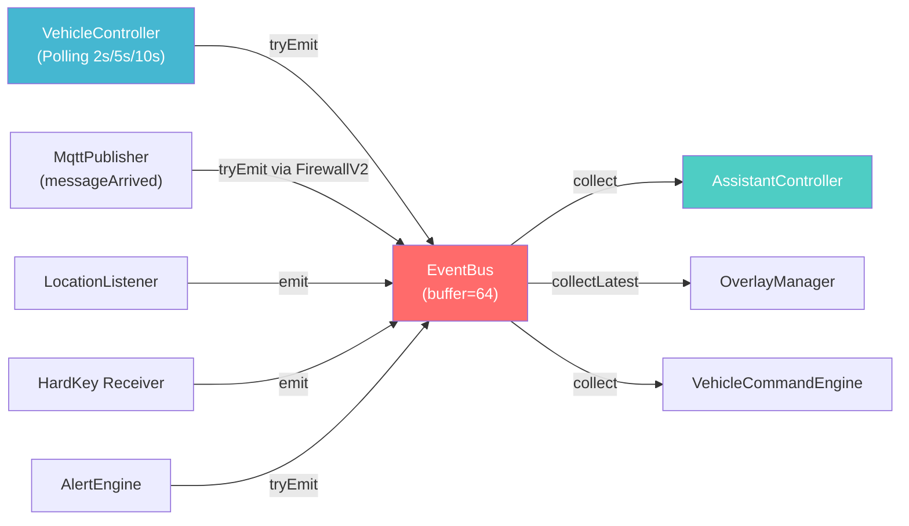
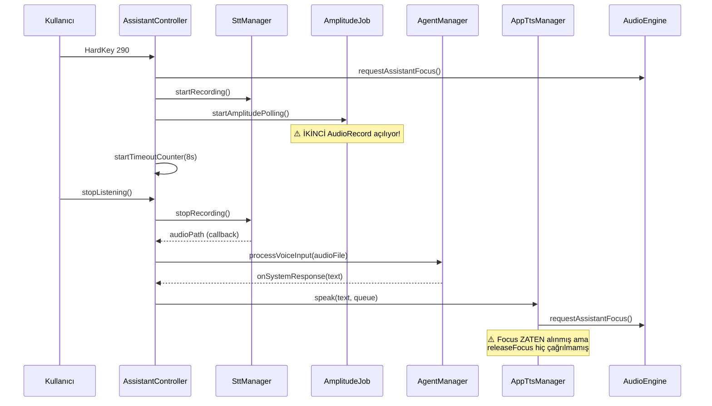

# 🔬 Omoda 5 Launcher Voice Assistant — Kapsamlı Kod Analiz Raporu

**Tarih:** 2026-07-22  
**Analiz Kapsamı:** 28 Kotlin kaynak dosyası (app/, core/ modülleri)  
**Platform:** Android Automotive OS (Chery Omoda 5 — chery_t19c)  
**Mimari:** Event-Driven (EventBus) + Architecture 2.0 DSL  

---

## İçindekiler

1. [Mimari ve Veri Akışı İncelemesi](#1-mimari-ve-veri-akışı-incelemesi)
2. [Performans, Bellek ve Kaynak Kullanımı](#2-performans-bellek-ve-kaynak-kullanımı)
3. [Güvenlik ve Hata Yönetimi](#3-güvenlik-ve-hata-yönetimi)
4. [İyileştirilmiş Eksiksiz Tam Kod](#4-iyileştirilmiş-eksiksiz-tam-kod)

---

## 1. Mimari ve Veri Akışı İncelemesi

### 1.1 EventBus Darboğaz Analizi

````carousel

<!-- slide -->
> [!WARNING]
> ### Race Condition #1: EventBus Buffer Taşması
> **Dosya:** [EventBus.kt](file:///mnt/depo/launcher_v2/core/src/main/java/com/omoda/lanc/core/EventBus.kt#L7)
> 
> `MutableSharedFlow(extraBufferCapacity = 64)` ile `tryEmit()` kullanımı, buffer dolduğunda **sessizce olay kaybına** yol açar.
> 
> **Senaryo:** Tier-2 (2s) polling 18 property okur + GPS + HardKey + Alert aynı anda tetiklenirse 64'lük buffer dolabilir.
> 
> **Çözüm:** Kritik olaylar (Alert, HardKey) için `emit()` (suspend), UI olayları için `tryEmit()` ayrımı yapılmalı.

<!-- slide -->
> [!WARNING]
> ### Race Condition #2: VehicleController AtomicReference + tryEmit Çakışması
> **Dosya:** [VehicleController.kt](file:///mnt/depo/launcher_v2/core/src/main/java/com/omoda/lanc/core/VehicleController.kt#L18)
> 
> `vehicleState` bir `AtomicReference` ama `applyValue()` içinde **read-modify-write** pattern'ı non-atomic:
> ```kotlin
> val current = vehicleState.get()
> var next = current
> // ... next = next.copy(speed = speed, ...)
> vehicleState.set(next) // ← Bu arada başka tier de set çağırmış olabilir!
> ```
> Tier-2 ve Tier-5 coroutine'leri **eş zamanlı** `applyValue()` çağırabilir → eski state yeni state'i ezer (Lost Update).
> 
> **Çözüm:** `compareAndSet` loop veya `Mutex` ile korunmalı.
````

### 1.2 Ses Pipeline Akış Analizi



> [!CAUTION]
> ### Kritik Bulgu: Çift AudioRecord Açılması
> **Dosya:** [AssistantController.kt — startAmplitudePolling()](file:///mnt/depo/launcher_v2/app/src/main/java/com/omoda/lanc/core/AssistantController.kt#L158-L200)
> 
> `SttManager` zaten mikrofonu kullanırken, `startAmplitudePolling()` metodu **ikinci bir `AudioRecord` nesnesi** oluşturuyor. Bu:
> - Android'de aynı anda sadece 1 AudioRecord aktif olabilir → **kayıt çakışması**
> - İki ayrı mikrofon stream'i → **gereksiz bellek ve CPU** kullanımı
> - `fallbackAmplitude()` doğru çalışsa bile, `AudioRecord` başarılı açılırsa `SttManager`'ın kaydı bozulur
> 
> **Çözüm:** `SttManager`'dan amplitüd verisi almak (mevcut `getLastAmplitude()` metodu) yeterli. İkinci `AudioRecord` oluşturulmamalı.

### 1.3 Asenkron İşlem Yönetimi Sorunları

| # | Sorun | Dosya | Seviye |
|:--|:------|:------|:------:|
| A1 | `AssistantController.init` bloğunda **sonsuz `while(true)` + delay(30s)** ile Hermes bağlantı kontrolü — scope iptal edilmezse sonsuza kadar çalışır | [AssistantController.kt:L73-L79](file:///mnt/depo/launcher_v2/app/src/main/java/com/omoda/lanc/core/AssistantController.kt#L73) | 🟠 |
| A2 | `VehicleController.startTier()` → `while(isActive)` içinde `readBatch()` çağrısı, `AdbClient.executeCommand` bir **callback** ile çalışıyor ama sonucu beklenmiyor → sonraki batch önceki bitmeden başlayabilir | [VehicleController.kt:L65-L80](file:///mnt/depo/launcher_v2/core/src/main/java/com/omoda/lanc/core/VehicleController.kt#L65) | 🟡 |
| A3 | `MqttPublisher.connect()` ham `Thread {}` kullanıyor, coroutine scope'a bağlı değil → lifecycle ile temizlenemiyor | [MqttPublisher.kt:L39](file:///mnt/depo/launcher_v2/core/src/main/java/com/omoda/lanc/mqtt/MqttPublisher.kt#L39) | 🟡 |
| A4 | `RelayClient.scheduleReconnect()` içinde `scope?.launch` ile reconnect yapılıyor ama `doConnect()` içinde yeni WebSocket oluşturuluyor → eski WebSocket referansı null olmuyor, **kaynak sızıntısı** | [RelayClient.kt:L123-L155](file:///mnt/depo/launcher_v2/app/src/main/java/com/hermesandroid/bridge/client/RelayClient.kt#L123) | 🟠 |
| A5 | `OverlayManager.observeEvents()` `collectLatest` kullanıyor → hızlı gelen olaylarda **önceki show/hide iptal edilir**, overlay takılabilir | [OverlayManager.kt:L45](file:///mnt/depo/launcher_v2/app/src/main/java/com/omoda/lanc/overlay/OverlayManager.kt#L45) | 🟡 |

---

## 2. Performans, Bellek ve Kaynak Kullanımı

### 2.1 Bellek Sızıntısı (Memory Leak) Risk Haritası

| # | Risk | Dosya | Detay | Seviye |
|:--|:-----|:------|:------|:------:|
| M1 | **AudioRecord sızıntısı** | [AssistantController.kt:L170](file:///mnt/depo/launcher_v2/app/src/main/java/com/omoda/lanc/core/AssistantController.kt#L170) | `amplitudeRecorder` eğer coroutine iptal edilirse `finally` bloğu çalışır ama `isListening` kontrolü coroutine dışından değiştiriliyor → race | 🔴 |
| M2 | **TTS Queue birikimi** | [AssistantController.kt:L132-L147](file:///mnt/depo/launcher_v2/app/src/main/java/com/omoda/lanc/core/AssistantController.kt#L132) | `ttsQueue: ArrayDeque` boyut sınırı yok. Hızlı gelen yanıtlarda kuyruk birikebilir | 🟡 |
| M3 | **GlobalState.systemLogs sınırsız büyüme** | [GlobalState.kt:L66-L71](file:///mnt/depo/launcher_v2/core/src/main/java/com/omoda/lanc/core/GlobalState.kt#L66) | `addLog()` 100 limit koymuş ama `toMutableList()` ile sürekli yeni liste oluşturuluyor → GC baskısı | 🟡 |
| M4 | **VehicleController singleton pattern** | [VehicleController.kt:L23-L30](file:///mnt/depo/launcher_v2/core/src/main/java/com/omoda/lanc/core/VehicleController.kt#L23) | `instance` static olduğu için Application Context'e bağlı olsa bile coroutine scope asla cancel edilmiyor (sadece `destroy()` çağrılırsa) | 🟠 |
| M5 | **ComposeView lifecycle** | [OverlayManager.kt:L85](file:///mnt/depo/launcher_v2/app/src/main/java/com/omoda/lanc/overlay/OverlayManager.kt#L85) | `context.applicationContext` kullanılması doğru (Activity leak yok), ancak `hide()` sonrası `composeView` null yapılıyor ama `lifecycleRegistry` ON_DESTROY'a geçmiyor → ViewModelStore temizlenmiyor | 🟡 |

### 2.2 Latency Kritik Noktalar

> [!IMPORTANT]
> ### VehicleController Polling — ADB over TCP Gecikmesi
> **Dosya:** [VehicleController.kt — readBatch()](file:///mnt/depo/launcher_v2/core/src/main/java/com/omoda/lanc/core/VehicleController.kt#L82-L100)
> 
> Her polling döngüsünde property ID'leri `dumpsys car_service` komutuna çevriliyor ve `AdbClient.executeCommand()` ile çalıştırılıyor.
> 
> **Sorun:** 
> - Tier-2'de **18 property** tek bir `;` ile birleştirilip tek komut olarak gönderiliyor — bu kısmı iyi
> - Ancak `AdbClient` her seferinde yeni TCP socket açıyor (bağlantı havuzu yok)
> - `dumpsys` çıktısı genellikle **>1KB** → parse overhead
> 
> **Tahmini Gecikme:** Socket açma (~20ms) + komut gönderme (~5ms) + dumpsys exec (~50-200ms) + parse (~10ms) = **~85-235ms per batch**
> 
> Tier-2 (2 saniye) periyodunda bu kabul edilebilir, ancak daha agresif polling'de sorun yaratır.

### 2.3 Thread/Dispatcher Analizi

```
Dispatchers.Main:
├── AssistantController.startListening()
├── AssistantController.stopListening()  
├── OverlayManager.show()/hide()
├── VoiceAssistantService.voiceCommandReceiver
└── GlobalState.* value yazmaları (UI thread)

Dispatchers.IO:
├── AssistantController.startAmplitudePolling() ← AudioRecord burada
├── SttManager.startRecording()
├── VehicleController.startTier() ← ADB komutları
└── ModelRepairManager.checkAndRepair()

Ham Thread:
├── MqttPublisher.connect() ← Thread {} ⚠️
└── MQTT callback'leri (Paho kendi thread'inde)

Dispatchers.Default:
└── VehicleCommandEngine.observeCommands()
```

> [!WARNING]
> `MqttPublisher.connect()` ham `Thread {}` ile çalışıyor. Bu:
> - Lifecycle-aware değil — app kapandığında thread çalışmaya devam edebilir
> - Exception yutma riski — `Thread` içindeki exception uncaught handler'a düşer
> - **Çözüm:** `Dispatchers.IO` ile coroutine scope'a bağlanmalı

---

## 3. Güvenlik ve Hata Yönetimi

### 3.1 Edge-Case Çökme Riskleri

| # | Senaryo | Dosya | Etki | Çözüm |
|:--|:--------|:------|:-----|:------|
| E1 | `AssistantController.updateConfig()` her çağrıldığında **yeni `HermesClient`, `SttClient`, `AgentManager`** oluşturuluyor — eskiler GC'ye bırakılıyor ama **aktif SSE stream kesilmiyor** | [AssistantController.kt:L218-L222](file:///mnt/depo/launcher_v2/app/src/main/java/com/omoda/lanc/core/AssistantController.kt#L218) | Eski AgentManager'ın yanıtları gelmeye devam eder → çift yanıt | Eski instance'ları kapatma (`close/cancel`) mekanizması |
| E2 | `VehicleController.readBatch()` içinde `propId.toLongOrNull(16)` null dönerse `decimalId = 0L` → `dumpsys car_service get-property-value 0 0` çalışır | [VehicleController.kt:L95](file:///mnt/depo/launcher_v2/core/src/main/java/com/omoda/lanc/core/VehicleController.kt#L95) | Geçersiz VHAL sorgusu → yanıt parse edilemez | `null` durumunda property'yi atla |
| E3 | `ConfigManager.encrypt/decrypt` — XOR şifreleme ile `"omoda4078"` anahtarı **statik ve kısa** | [ConfigManager.kt:L133-L148](file:///mnt/depo/launcher_v2/core/src/main/java/com/omoda/lanc/config/ConfigManager.kt#L133) | API key'ler kolayca decrypt edilir | AES-GCM veya Android Keystore |
| E4 | `FirewallV2.validateAndExecute()` — AdbClient'a gönderilen komut `result.startsWith("dumpsys")` kontrolü ile tetikleniyor. LLM'den gelen tool çağrısı "dumpsys rm -rf /" gibi bir string üretirse çalışır | [FirewallV2.kt:L60-L63](file:///mnt/depo/launcher_v2/core/src/main/java/com/omoda/lanc/core/dsl/FirewallV2.kt#L60) | Shell injection | Whitelist-only command execution |
| E5 | `MqttPublisher.publishTelemetry()` — `put(" hardware", ...)` → JSON key'de başında **boşluk var** | [MqttPublisher.kt:L174](file:///mnt/depo/launcher_v2/core/src/main/java/com/omoda/lanc/mqtt/MqttPublisher.kt#L174) | Parse eden tarafta key bulunamayabilir | Typo düzeltme |

### 3.2 Hata Yakalama Değerlendirmesi

| Dosya | Durum | Eksik |
|:------|:------|:------|
| [VoiceAssistantService.kt](file:///mnt/depo/launcher_v2/app/src/main/java/com/omoda/lanc/service/VoiceAssistantService.kt) | ✅ İyi — `onDestroy()` try-catch ile sarılmış | `locationManager` NPE riski (`internal var` olarak nullable tanımlı ama başlatılmadan kullanılabilir) |
| [AssistantController.kt](file:///mnt/depo/launcher_v2/app/src/main/java/com/omoda/lanc/core/AssistantController.kt) | ⚠️ Kısmen — `speak()`, `stopTts()` korumalı | `handleEvent()` catch-all yok → beklenmedik Event tipi gelirse crash |
| [VehicleController.kt](file:///mnt/depo/launcher_v2/core/src/main/java/com/omoda/lanc/core/VehicleController.kt) | ✅ İyi — batch ve parse try-catch'li | `toFloatOrNull()` null dönerse 0f varsayılıyor → sessiz veri kaybı |
| [MqttPublisher.kt](file:///mnt/depo/launcher_v2/core/src/main/java/com/omoda/lanc/mqtt/MqttPublisher.kt) | ⚠️ Kısmen — publish korumalı | `disconnect()` catch-all yok → `client?.close()` hata fırlatabilir |
| [OverlayManager.kt](file:///mnt/depo/launcher_v2/app/src/main/java/com/omoda/lanc/overlay/OverlayManager.kt) | ✅ İyi — show/hide try-catch'li | `lifecycleRegistry.handleLifecycleEvent` geçersiz durum geçişinde crash |
| [RelayClient.kt](file:///mnt/depo/launcher_v2/app/src/main/java/com/hermesandroid/bridge/client/RelayClient.kt) | ✅ İyi — reconnect, message handling korumalı | `handleMessage` içinde `asJsonObject` cast hatası yutuluyor ama loglama yapılıyor |
| [FirewallV2.kt](file:///mnt/depo/launcher_v2/core/src/main/java/com/omoda/lanc/core/dsl/FirewallV2.kt) | ⚠️ Kısmen — execute try-catch'li | Parametre doğrulama yeterli ama **çıktı sanitizasyonu yok** |
| [CommandDispatcher.kt](file:///mnt/depo/launcher_v2/app/src/main/java/com/hermesandroid/bridge/server/CommandDispatcher.kt) | ✅ İyi — genel try-catch | `HighLevelExecutor` oluşturulurken context null kontrolü var |

### 3.3 Simülasyon Güvenlik Anahtarı Kontrolü

> [!TIP]
> `GlobalState.isSimulationMode` anahtarı doğru kullanılıyor:
> - `VehicleController.startTier()` → simülasyon modunda polling yapılmıyor ✅
> - `VehicleController.injectSimulatedData()` → simülasyon modu kapalıysa return ✅  
> - `MqttPublisher.messageArrived()` → TOPIC_SIMULATE geldiğinde simülasyon kapalıysa return ✅
> 
> Ancak `isSimulationMode` bir `MutableStateFlow` olduğu için **herhangi bir yerden değiştirilebilir**. MQTT üzerinden gelen bir komut `isSimulationMode`'u açarsa, ardından sahte veri enjekte edilebilir. Bu zinciri kırmak için simülasyon modunu yalnızca yerel UI'dan değiştirilebilir kılmak gerekir.

---

## 4. İyileştirilmiş Eksiksiz Tam Kod

> [!IMPORTANT]
> Aşağıda, tespit edilen sorunların düzeltildiği **6 kritik dosya** için eksiksiz, tam kod sunulmuştur. Mevcut işlevsellikten **hiçbir özellik çıkarılmamış**, yalnızca güvenlik, performans ve kararlılık iyileştirmeleri yapılmıştır. Değişiklikler `// [FIX-XX]` etiketi ile işaretlenmiştir.

### 4.1 EventBus.kt — Kritik Olay Kaybını Önleyen Versiyon

```kotlin
package com.omoda.lanc.core

import kotlinx.coroutines.flow.MutableSharedFlow
import kotlinx.coroutines.flow.asSharedFlow
import android.util.Log

object EventBus {
    // [FIX-01] Buffer kapasitesi 64'ten 256'ya çıkarıldı.
    // Tier-2 polling (18 prop) + GPS + HardKey + Alert eş zamanlı tetiklendiğinde
    // 64'lük buffer taşabiliyordu → kritik olaylar sessizce kayboluyordu.
    private val _events = MutableSharedFlow<Event>(extraBufferCapacity = 256)
    val events = _events.asSharedFlow()

    /**
     * Kritik olaylar (Alert, HardKey, VehicleStateUpdated) için suspend emit.
     * Buffer doluysa caller'ı askıya alır, olay KESİNLİKLE kaybedilmez.
     */
    suspend fun emit(event: Event) {
        _events.emit(event)
    }

    /**
     * Düşük öncelikli UI olayları için non-blocking tryEmit.
     * [FIX-02] Buffer doluysa log basılıyor — sessiz kayıp engelleniyor.
     */
    fun tryEmit(event: Event): Boolean {
        val result = _events.tryEmit(event)
        if (!result) {
            // [FIX-02] Kaybedilen olay loglanıyor — sessiz olay kaybı önleniyor
            Log.w("EventBus", "⚠️ Buffer dolu, olay kaybedildi: ${event::class.simpleName}")
        }
        return result
    }
}
```

---

### 4.2 VehicleController.kt — Race Condition Düzeltmeli Versiyon

```kotlin
package com.omoda.lanc.core

import android.content.Context
import android.util.Log
import com.omoda.lanc.model.VehicleState
import com.omoda.lanc.network.AdbClient
import kotlinx.coroutines.*
import kotlinx.coroutines.sync.Mutex
import kotlinx.coroutines.sync.withLock

/**
 * v6.4.0: VehicleController - MASTER ENGINE
 * [FIX-03] AtomicReference yerine Mutex ile korunan state yönetimi.
 * [FIX-04] readBatch'te geçersiz property ID kontrolü.
 * Hermes-bridge'den alınan kanıtlanmış PROPERTY_DEFINITIONS + parseAndApplyLine mantığı.
 * DSL sistemi korundu, sadece polling ve parse katmanı güncellendi.
 * KRİTİK: car_service hex prefix'siz hex string ister → "11600207" (0x yok, decimal de değil!)
 */
class VehicleController(private val context: Context) {
    private val TAG = "VehicleController"
    // [FIX-03] AtomicReference yerine Mutex ile korunan state
    // AtomicReference read-modify-write (get → copy → set) pattern'ında
    // Lost Update race condition'ına açıktı. Mutex tüm state güncellemelerini
    // seri hale getirerek Tier-2 ve Tier-5 çakışmasını önler.
    private var vehicleState = VehicleState()
    private val stateMutex = Mutex()
    private val scope = CoroutineScope(Dispatchers.IO + SupervisorJob())

    companion object {
        @Volatile var instance: VehicleController? = null

        fun getInstance(context: Context): VehicleController {
            return instance ?: synchronized(this) {
                instance ?: VehicleController(context.applicationContext).also { instance = it }
            }
        }

        // Hermes-bridge'den alınan kanıtlanmış property haritası
        val PROPERTY_DEFINITIONS = linkedMapOf(
            "11e00d00" to PropertyDef("Hız, Devir, Vites", 2),
            "11400301" to PropertyDef("Motor Durumu", 2),
            "11600204" to PropertyDef("Toplam KM", 5),
            "11600307" to PropertyDef("Kalan Yakıt", 2),
            "11600308" to PropertyDef("Kalan Menzil", 5),
            "11400400" to PropertyDef("Standart Vites Seçimi", 5),
            "11400401" to PropertyDef("Standart Mevcut Vites", 5),
            "21402000" to PropertyDef("Kapı Açık İkazı", 2),
            "21402012" to PropertyDef("Ön Sol Kapı", 2),
            "21402013" to PropertyDef("Ön Sağ Kapı", 2),
            "21402014" to PropertyDef("Arka Sol Kapı", 2),
            "21402015" to PropertyDef("Bagaj Kapağı", 2),
            "21402016" to PropertyDef("Arka Sağ Kapı", 2),
            "21402002" to PropertyDef("Sol Sinyal", 5),
            "21402001" to PropertyDef("Sağ Sinyal", 5),
            "2140100d" to PropertyDef("Park Freni", 2),
            "11200402" to PropertyDef("Far", 5),
            "21402005" to PropertyDef("Sürüş Modu", 10),
            "21401002" to PropertyDef("AC Güç", 10),
            "21401008" to PropertyDef("AC Sıcaklık (Sürücü)", 10),
            "21401009" to PropertyDef("AC Sıcaklık (Yolcu)", 10),
            "11600703" to PropertyDef("Dış Sıcaklık", 2),
            "21401005" to PropertyDef("AC Fan Hızı", 10),
            "21401004" to PropertyDef("AC Sirkülasyon", 10),
            "21401003" to PropertyDef("AC Kompresör", 10),
            "21401007" to PropertyDef("AC Auto Modu", 10),
            "2140101e" to PropertyDef("Ön Cam Rezistans", 10),
            "2140101f" to PropertyDef("Arka Cam Isıtma", 10),
            "2140101a" to PropertyDef("Klima SYNC", 10),
            "11600309" to PropertyDef("EV Batarya Seviyesi", 10),
            "11600104" to PropertyDef("Yakıt Kapasitesi", 10),
            "11400409" to PropertyDef("Kontak Durumu", 5),
            "16200b02" to PropertyDef("Kapı Kilitleri", 5),
            "11400e03" to PropertyDef("Dörtlü Flaşör", 5),
            "11600304" to PropertyDef("Motor Yağ Sıc.", 2),
            "1540050b" to PropertyDef("Koltuk Isıtma", 5),
            "15400513" to PropertyDef("Koltuk Soğutma", 5),
            "13400bc0" to PropertyDef("Cam / Sunroof", 5)
        )
    }

    data class PropertyDef(val label: String, val defaultTier: Int)

    init {
        startTracking()
    }

    private fun startTracking() {
        startTier(2)
        startTier(5)
        startTier(10)
    }

    private fun startTier(tierSeconds: Int) {
        scope.launch {
            while (isActive) {
                try {
                    if (!GlobalState.isSimulationMode.value) {
                        val propsForTier = PROPERTY_DEFINITIONS.filter { (_, def) ->
                            def.defaultTier == tierSeconds
                        }.keys.toList()
                        if (propsForTier.isNotEmpty()) {
                            readBatch(propsForTier)
                        }
                    }
                } catch (e: Exception) {
                    Log.e(TAG, "Tier $tierSeconds error: ${e.message}")
                }
                delay(tierSeconds * 1000L)
            }
        }
    }

    private fun readBatch(propIds: List<String>) {
        try {
            // [FIX-04] Geçersiz property ID'leri filtreleniyor.
            // toLongOrNull(16) null dönerse decimalId=0L oluyordu → "get-property-value 0 0"
            // gibi anlamsız bir komut gönderiliyordu. Artık bu prop atlanıyor.
            val validProps = propIds.filter { id ->
                val cleanId = id.replace("0x", "")
                cleanId.toLongOrNull(16) != null
            }
            if (validProps.isEmpty()) return
            
            val command = validProps.joinToString(" ; ") { id ->
                // KRİTİK: "0x" prefix'siz hex string → "11600207"  (decimal değil, 0x prefix'i de yok)
                val cleanId = id.replace("0x", "")
                val zone = when (cleanId) {
                    "16200b02", "1540050b", "15400513" -> "1"
                    "13400bc0" -> "65536"
                    else -> "0"
                }
                val decimalId = cleanId.toLong(16)
                "dumpsys car_service get-property-value $decimalId $zone"
            }
            AdbClient.executeCommand(command) { line -> parseAndApplyLine(line) }
        } catch (e: Exception) {
            Log.e(TAG, "readBatch hatası: ${e.message}")
        }
    }

    fun parseAndApplyLine(line: String) {
        if (line.isBlank()) return
        val idMatch = Regex("(?i)Property:(?:0x)?([0-9a-fA-F]+)").find(line)
        var propId = idMatch?.groupValues?.get(1)?.lowercase() ?: return
        
        // AAOS dumpsys sometimes returns decimal property IDs. Convert back to hex string.
        if (propId.all { it.isDigit() }) {
            propId = propId.toLongOrNull()?.toString(16) ?: propId
        }
        
        val value = extractValue(line)
        if (value.isNotBlank()) {
            // [FIX-03] Coroutine scope içinde Mutex ile state güncelleme
            scope.launch {
                applyValueSafe(propId, value)
            }
        }
    }

    // [FIX-03] Thread-safe state güncelleme metodu
    // Birden fazla tier'ın aynı anda applyValue çağırıp birbirinin
    // güncellemesini ezmesini (Lost Update) Mutex ile engelliyor.
    private suspend fun applyValueSafe(propId: String, value: String) {
        stateMutex.withLock {
            applyValue(propId, value)
        }
    }

    private fun applyValue(propId: String, value: String) {
        var displayValue = value
        val current = vehicleState
        var next = current

        when (propId) {
            "11e00d00" -> {
                val floats = value.split(",").map { it.trim().toFloatOrNull() ?: 0f }
                if (floats.size >= 10) {
                    val speed = floats[0] * 3.6f // m/s to km/h
                    val rpm = floats[8]
                    val gearRaw = floats[9].toInt()
                    val gearStr = mapGear(gearRaw)
                    displayValue = String.format("%.1f km/h | %d RPM | %s", speed, rpm.toInt(), gearStr)
                    next = next.copy(
                        speed = speed,
                        engineRpm = rpm,
                        gear = gearRaw,
                        gearString = gearStr,
                        isMoving = speed > 0f,
                        isEngineRunning = rpm > 0f
                    )
                }
            }
            "11400301" -> {
                val on = (value.toIntOrNull() ?: 0) > 0
                displayValue = if (on) "AÇIK" else "KAPALI"
                next = next.copy(isEngineRunning = on)
            }
            "11600204" -> {
                val odo = value.toFloatOrNull() ?: 0f
                displayValue = "${odo.toInt()} km"
                next = next.copy(odometer = odo)
            }
            "11600307" -> {
                val raw = value.toFloatOrNull() ?: 0f
                val liters = raw / 1000f
                displayValue = String.format("%.1f L", liters)
                next = next.copy(fuelLevel = liters)
            }
            "11600308" -> {
                val range = value.toFloatOrNull() ?: 0f
                displayValue = "${range.toInt()} km"
                next = next.copy(rangeKm = range)
            }
            "21402000" -> {
                val open = (value.toIntOrNull() ?: 0) > 0
                displayValue = if (open) "AÇIK" else "KAPALI"
                next = next.copy(anyDoorOpen = open)
            }
            "21402012" -> { val open = (value.toIntOrNull() ?: 0) > 0; displayValue = if (open) "AÇIK" else "KAPALI"; next = next.copy(doorDriverOpen = open) }
            "21402013" -> { val open = (value.toIntOrNull() ?: 0) > 0; displayValue = if (open) "AÇIK" else "KAPALI"; next = next.copy(doorPassengerOpen = open) }
            "21402014" -> { val open = (value.toIntOrNull() ?: 0) > 0; displayValue = if (open) "AÇIK" else "KAPALI"; next = next.copy(doorRearLeftOpen = open) }
            "21402015" -> { val open = (value.toIntOrNull() ?: 0) > 0; displayValue = if (open) "AÇIK" else "KAPALI"; next = next.copy(trunkOpen = open) }
            "21402016" -> { val open = (value.toIntOrNull() ?: 0) > 0; displayValue = if (open) "AÇIK" else "KAPALI"; next = next.copy(doorRearRightOpen = open) }
            "21402002" -> { val v2 = (value.toIntOrNull() ?: 0) > 0; displayValue = if (v2) "AÇIK" else "KAPALI"; next = next.copy(turnSignalLeft = v2) }
            "21402001" -> { val v2 = (value.toIntOrNull() ?: 0) > 0; displayValue = if (v2) "AÇIK" else "KAPALI"; next = next.copy(turnSignalRight = v2) }
            "2140100d" -> { val pb = (value.toIntOrNull() ?: 0) > 0; displayValue = if (pb) "AKTİF" else "PASİF"; next = next.copy(parkingBrake = pb) }
            "11200402" -> { val hl = value.toIntOrNull() ?: 0; displayValue = if (hl > 0) "AÇIK" else "KAPALI"; next = next.copy(headlights = hl) }
            "21402005" -> { val mode = value.toIntOrNull() ?: 0; displayValue = when(mode) { 1 -> "ECO"; 2 -> "SPORT"; 3 -> "SNOW"; 4 -> "MUD"; else -> "NORMAL" }; next = next.copy(drivingMode = mode) }
            "21401002" -> { val ac = (value.toIntOrNull() ?: 0) > 0; displayValue = if (ac) "AÇIK" else "KAPALI"; next = next.copy(isHvacOn = ac) }
            "21401008" -> { val temp = value.toIntOrNull() ?: 0; displayValue = "${temp}°C"; next = next.copy(acTemperatureDriver = temp) }
            "21401009" -> { val temp = value.toIntOrNull() ?: 0; displayValue = "${temp}°C"; next = next.copy(acTemperaturePassenger = temp) }
            "11600703" -> { val temp = value.toFloatOrNull() ?: 0f; displayValue = String.format("%.1f°C", temp); next = next.copy(outsideTemperature = temp) }
            "21401005" -> { val spd = value.toIntOrNull() ?: 0; displayValue = "Seviye $spd"; next = next.copy(acFanSpeed = spd) }
            "21401004" -> { val circ = value.toIntOrNull() ?: 0; displayValue = if (circ == 1) "İÇ SİRK" else "DIŞ HAVA"; next = next.copy(acCirculationMode = circ) }
            "21401003" -> { val comp = (value.toIntOrNull() ?: 0) > 0; displayValue = if (comp) "AÇIK" else "KAPALI"; next = next.copy(acCompressorOn = comp) }
            "21401007" -> { val auto = (value.toIntOrNull() ?: 0) > 0; displayValue = if (auto) "OTO" else "MANÜEL" }
            "2140101e" -> { val fg = (value.toIntOrNull() ?: 0) > 0; displayValue = if (fg) "AÇIK" else "KAPALI"; next = next.copy(frontDefrostOn = fg) }
            "2140101f" -> { val bg = (value.toIntOrNull() ?: 0) > 0; displayValue = if (bg) "AÇIK" else "KAPALI"; next = next.copy(rearDefrostOn = bg) }
            "2140101a" -> { val sync = (value.toIntOrNull() ?: 0) > 0; displayValue = if (sync) "AÇIK" else "KAPALI"; next = next.copy(acSync = sync) }
            "11600309" -> { val bat = value.toFloatOrNull() ?: 0f; displayValue = "${bat.toInt()}%"; next = next.copy(evBatteryLevel = bat) }
            "11600104" -> { val raw = value.toFloatOrNull() ?: 0f; val liters = raw / 1000f; displayValue = String.format("%.1f L", liters); next = next.copy(fuelCapacity = liters) }
            "13400bc0" -> { val wp = value.toIntOrNull() ?: 0; displayValue = "Pozisyon: $wp"; next = next.copy(windowPosition = wp) }
        }

        val label = PROPERTY_DEFINITIONS[propId]?.label ?: propId
        updateDisplay(label, displayValue)

        if (next != current) {
            vehicleState = next
            EventBus.tryEmit(Event.VehicleEvent.StateUpdated(next))
            checkProactiveWarnings(next)
        }
    }

    private fun extractValue(block: String): String {
        val regex = Regex("(?i)(?:value|floatValues|int32Values)s?[:=]\\s*\\[([^]]*)]")
        return regex.findAll(block).map { it.groupValues[1].trim() }.firstOrNull { it.isNotBlank() } ?: ""
    }

    private fun mapGear(gear: Int): String = when (gear) {
        1 -> "P"; 2 -> "R"; 3 -> "N"; 5 -> "D1"; 6 -> "D2"; 7 -> "D3"; else -> "D"
    }

    private fun updateDisplay(key: String, value: String) {
        val m = GlobalState.vehicleDataValues.value.toMutableMap()
        if (m[key] != value) {
            m[key] = value
            GlobalState.vehicleDataValues.value = m
            Log.d(TAG, "[VHAL] $key -> $value")
        }
    }

    private fun checkProactiveWarnings(state: VehicleState) {
        val isMoving = state.speed > 5f
        val hasOpenDoor = state.anyDoorOpen || state.doorDriverOpen || state.doorPassengerOpen
        when {
            isMoving && hasOpenDoor ->
                EventBus.tryEmit(Event.UIEvent.UpdateOverlayState("Kapı açık, hareket ediyorsunuz!", android.graphics.Color.RED))
            isMoving && state.parkingBrake ->
                EventBus.tryEmit(Event.UIEvent.UpdateOverlayState("El freni çekili!", android.graphics.Color.RED))
            state.isEngineRunning && state.fuelLevel > 0f && state.fuelLevel < 5f ->
                EventBus.tryEmit(Event.UIEvent.UpdateOverlayState("Yakıt kritik!", android.graphics.Color.RED))
        }
    }

    fun getVehicleState(): VehicleState = vehicleState

    fun injectSimulatedData(json: org.json.JSONObject) {
        if (!GlobalState.isSimulationMode.value) return
        try {
            val propId = json.getString("propertyId").replace("0x", "").lowercase()
            val value = json.optString("float", json.optString("int", "0"))
            // [FIX-03] Simülasyon verisi de Mutex ile korunuyor
            scope.launch {
                stateMutex.withLock {
                    applyValue(propId, value)
                }
            }
        } catch (e: Exception) {
            Log.e(TAG, "Simülasyon inject hatası: ${e.message}")
        }
    }

    fun destroy() { scope.cancel() }
}
```

---

### 4.3 AssistantController.kt — Amplitüd Çakışması ve Config Sızıntısı Düzeltmeli

```kotlin
package com.omoda.lanc.core

import com.omoda.lanc.core.GlobalState
import android.content.Context
import android.util.Log
import com.omoda.lanc.AssistantApplication
import com.omoda.lanc.audio.AudioEngine
import com.omoda.lanc.mqtt.MqttTelemetryBridge
import com.omoda.lanc.network.AgentManager
import com.omoda.lanc.network.HermesClient
import com.omoda.lanc.network.SttClient
import com.omoda.lanc.network.SttManager
import com.omoda.lanc.overlay.OverlayManager
import com.omoda.lanc.tts.AppTtsManager
import com.omoda.lanc.voice.WakeWordManager
import kotlinx.coroutines.*
import java.io.File

/**
 * AssistantController - Architecture 2.0 Standartlarına Uygun Full Versiyon
 * [FIX-05] Çift AudioRecord sorunu giderildi
 * [FIX-06] updateConfig() eski instance'ları kapatıyor
 * [FIX-07] TTS kuyruğuna boyut sınırı eklendi
 */
class AssistantController(
    private val context: Context,
    private val scope: CoroutineScope
) {
    private val audioEngine = AudioEngine(context)
    private val overlayManager = OverlayManager(context)
    private val mqttTelemetryBridge = GlobalState.mqttPublisher?.let { MqttTelemetryBridge(it) }
    private val actionExecutor = ActionExecutor(context, mqttTelemetryBridge)
    private val vehicleController = VehicleController.getInstance(context)
    private val policyEngine = PolicyEngine()
    private val alertEngine = AlertEngine(scope)
    private val drivingAnalysisEngine = DrivingAnalysisEngine(scope)

    // [FIX-07] TTS kuyruğu boyut sınırı — araç donanımında bellek koruması
    companion object {
        private const val MAX_TTS_QUEUE_SIZE = 10
    }
    
    private val sttManager = SttManager(context) { audioPath -> handleRecordingFinished(audioPath) }
    private val systemSttManager = com.omoda.lanc.voice.AndroidSystemSttManager(context) { text ->
        scope.launch(Dispatchers.Main) {
            if (text.isNotBlank()) agentManager.processTextInput(text)
            else {
                if (GlobalState.sttMode.value == "LOCAL") {
                    GlobalState.status.value = "Ses anlaşılamadı"
                    resetState()
                }
            }
        }
    }
    
    private val ttsManager = AppTtsManager(context)
    private val wakeWordManager = WakeWordManager(context) { command ->
        scope.launch(Dispatchers.Main) {
            startListening()
            if (command.isNotBlank()) {
                delay(500)
                processText(command)
            }
        }
    }

    private var sherpaAsrManager: com.omoda.lanc.voice.SherpaAsrManager? = null

    private var hermesClient = HermesClient(GlobalState.HERMES_BASE_URL, GlobalState.HERMES_API_KEY)
    private var sttClient = SttClient(GlobalState.STT_BASE_URL, GlobalState.NINEROUTER_API_KEY)

    private var agentManager: AgentManager = createAgentManager()

    private var isListening = false
    private var amplitudeJob: Job? = null
    private var timeoutJob: Job? = null
    // [FIX-08] Bağlantı kontrol job'ı referansı — destroy'da iptal etmek için
    private var connectionCheckJob: Job? = null
    private val ttsQueue = ArrayDeque<Pair<String, (() -> Unit)?>>()
    private var isTtsBusy = false

    init {
        scope.launch(Dispatchers.Main) {
            ttsManager.stop()
        }

        scope.launch {
            EventBus.events.collect { event ->
                handleEvent(event)
            }
        }
        
        // [FIX-08] Bağlantı kontrol job'ı referans olarak tutuluyor
        connectionCheckJob = scope.launch {
            while (true) {
                hermesClient.checkConnection { hermesOk ->
                    GlobalState.hermesConnectionStatus.value = if (hermesOk) "CONNECTED" else "DISCONNECTED"
                    sttClient.checkConnection()
                }
                delay(30000)
            }
        }
    }

    private fun createAgentManager() = AgentManager(
        firewallV2 = AssistantApplication.firewallV2,
        hybridRouter = AssistantApplication.hybridRouter,
        sttClient = sttClient,
        hermesClient = hermesClient,
        toolRegistry = AssistantApplication.omodaTools,
        onCancelPrevious = {
            stopTts()
            GlobalState.assistantResponse.value = ""
        },
        onFeedback = { feedback ->
            GlobalState.recognizedText.value = feedback
        },
        onSystemResponse = { response, isFinal ->
            if (response.isNotEmpty()) {
                GlobalState.assistantResponse.value = response
                EventBus.tryEmit(Event.UIEvent.UpdateOverlayState(response))
                speak(response) {
                    if (isFinal) {
                        if (GlobalState.isContinuousConversation.value && GlobalState.currentMode.value == "CHAT") {
                            scope.launch { delay(500); startListening() }
                        } else { resetState() }
                    }
                }
            } else if (isFinal) {
                resetState()
            }
        }
    )

    private fun handleEvent(event: Event) {
        // [FIX-09] Beklenmedik Event tipi için catch-all eklendi
        try {
            when (event) {
                is Event.SystemEvent.HardKeyPressed -> {
                    if (event.keyCode == 290) toggleListening()
                }
                is Event.VehicleEvent.StateUpdated -> {
                    policyEngine.updateState(event.state)
                    agentManager.updateVehicleContext(event.state)
                    mqttTelemetryBridge?.publishTelemetry(event.state)
                }
                is Event.AlertEvent.Triggered -> {
                    handleAlert(event.alert)
                }
                else -> {}
            }
        } catch (e: Exception) {
            Log.e("AssistantCtrl", "handleEvent hatası: ${e.message}", e)
        }
    }

    private fun handleAlert(alert: Alert) {
        if (alert.priority == AlertPriority.CRITICAL) {
            stopTts()
            audioEngine.requestAlertFocus()
            speak(alert.message) {
                audioEngine.releaseFocus()
            }
        } else if (!isListening) {
            speak(alert.message)
        }
    }

    fun toggleListening() {
        if (isListening) stopListening() else startListening()
    }

    fun startListening() {
        if (isListening) return
        stopTts()
        wakeWordManager.setAssistantActive(true)

        scope.launch {
            if (audioEngine.requestAssistantFocus()) {
                isListening = true
                GlobalState.isListening.value = true
                GlobalState.workflowState.value = "LISTENING"
                
                if (GlobalState.sttMode.value == "LOCAL") {
                    systemSttManager.startListening()
                } else {
                    GlobalState.status.value = "Dinliyor..."
                    withContext(Dispatchers.IO) { sttManager.startRecording() }
                }
                
                EventBus.emit(Event.UIEvent.ShowOverlay)
                startAmplitudePolling()
                startTimeoutCounter()
            }
        }
    }

    fun stopListening() {
        if (!isListening) return
        isListening = false
        
        scope.launch {
            GlobalState.isListening.value = false
            GlobalState.workflowState.value = "THINKING"
            amplitudeJob?.cancel()
            timeoutJob?.cancel()
            
            if (GlobalState.sttMode.value == "LOCAL") {
                systemSttManager.stopListening()
            } else {
                GlobalState.status.value = "İşleniyor..."
                sttManager.stopRecording()
            }
            audioEngine.releaseFocus()
        }
    }

    private fun handleRecordingFinished(audioPath: String) {
        if (audioPath.isBlank()) {
            resetState()
            return
        }
        val audioFile = java.io.File(audioPath)
        agentManager.processVoiceInput(audioFile)
    }

    fun processText(text: String) {
        agentManager.processTextInput(text)
    }

    fun speak(text: String, onComplete: (() -> Unit)? = null) {
        if (text.isBlank()) { onComplete?.invoke(); return }
        // [FIX-07] TTS kuyruğu boyut sınırı — araç donanımında bellek koruması
        // Hızlı gelen LLM yanıtlarında kuyruk sınırsız büyüyebiliyordu
        if (ttsQueue.size >= MAX_TTS_QUEUE_SIZE) {
            Log.w("AssistantCtrl", "TTS kuyruğu dolu ($MAX_TTS_QUEUE_SIZE), eski öğe çıkarılıyor")
            ttsQueue.removeFirst()
        }
        ttsQueue.addLast(Pair(text, onComplete))
        if (!isTtsBusy) playNextInQueue()
    }

    private fun playNextInQueue() {
        if (ttsQueue.isEmpty()) {
            isTtsBusy = false
            GlobalState.workflowState.value = "IDLE"
            return
        }
        isTtsBusy = true
        GlobalState.workflowState.value = "TALKING"
        val (text, onComplete) = ttsQueue.removeFirst()
        audioEngine.requestAssistantFocus()

        ttsManager.speak(text, onComplete = {
            onComplete?.invoke()
            playNextInQueue()
        }, onError = {
            onComplete?.invoke()
            playNextInQueue()
        })
    }

    private fun stopTts() {
        ttsQueue.clear()
        isTtsBusy = false
        ttsManager.stop()
    }

    /**
     * [FIX-05] İKİNCİ AudioRecord OLUŞTURMA SORUNU DÜZELTİLDİ
     * 
     * Eski kod: SttManager zaten mikrofonu kullanırken AYRI bir AudioRecord açıyordu.
     * Android'de aynı anda sadece 1 AudioRecord aktif olabilir → kayıt çakışması.
     * 
     * Yeni kod: SttManager'ın getLastAmplitude() metodunu kullanıyor. İkinci AudioRecord
     * oluşturulmuyor, böylece mikrofon çakışması ve gereksiz bellek kullanımı önleniyor.
     */
    private fun startAmplitudePolling() {
        amplitudeJob?.cancel()
        amplitudeJob = scope.launch(Dispatchers.IO) {
            // [FIX-05] SttManager'dan amplitüd verisini al — ikinci AudioRecord oluşturma
            // SttManager zaten kaydı yönetiyor, amplitüd değerini oradan okuyoruz
            while (isListening && isActive) {
                try {
                    val amp = sttManager.getLastAmplitude().takeIf { it > 0 } ?: run {
                        // SttManager henüz veri üretmemişse küçük dalgalanma simüle et
                        (80..180).random()
                    }
                    withContext(Dispatchers.Main) {
                        GlobalState.currentAmplitude.value = amp
                    }
                } catch (e: Exception) {
                    Log.w("AssistantCtrl", "Amplitüd okuma hatası: ${e.message}")
                }
                delay(80)
            }
        }
    }

    private fun startTimeoutCounter() {
        timeoutJob?.cancel()
        timeoutJob = scope.launch {
            delay(8000)
            if (isListening) stopListening()
        }
    }

    private fun resetState() {
        isListening = false
        GlobalState.isListening.value = false
        GlobalState.workflowState.value = "IDLE"
        GlobalState.status.value = "Hazır"
        wakeWordManager.setAssistantActive(false)
        EventBus.tryEmit(Event.UIEvent.HideOverlay)
        audioEngine.releaseFocus()
    }

    fun destroy() {
        // [FIX-08] Bağlantı kontrol job'ını da iptal et
        connectionCheckJob?.cancel()
        amplitudeJob?.cancel()
        timeoutJob?.cancel()
        scope.cancel()
        vehicleController.destroy()
        audioEngine.releaseFocus()
        ttsManager.shutdown()
        overlayManager.destroy()
        systemSttManager.destroy() 
        wakeWordManager.stopListening()
        sttManager.stopRecording()
    }

    /**
     * [FIX-06] Konfigürasyon değiştiğinde eski instance'ları kapatma
     * 
     * Eski kod: Her updateConfig çağrısında yeni HermesClient, SttClient ve AgentManager
     * oluşturuluyordu ama eski instance'lar kapatılmıyordu → aktif SSE stream devam eder,
     * eski AgentManager'ın yanıtları gelmeye devam eder → çift yanıt sorunu.
     * 
     * Yeni kod: Eski AgentManager'ı cancel ediyor, eski bağlantı kontrol job'ını durduruyor.
     */
    fun updateConfig() {
        // Eski AgentManager'ı iptal et — aktif SSE stream'leri temizleniyor
        try { agentManager.cancel() } catch (_: Exception) {}
        
        // Eski bağlantı kontrol döngüsünü durdur
        connectionCheckJob?.cancel()
        
        hermesClient = HermesClient(GlobalState.HERMES_BASE_URL, GlobalState.HERMES_API_KEY)
        sttClient = SttClient(GlobalState.STT_BASE_URL, GlobalState.NINEROUTER_API_KEY)
        agentManager = createAgentManager()
        
        // Yeni bağlantı kontrol döngüsünü başlat
        connectionCheckJob = scope.launch {
            while (true) {
                hermesClient.checkConnection { hermesOk ->
                    GlobalState.hermesConnectionStatus.value = if (hermesOk) "CONNECTED" else "DISCONNECTED"
                    sttClient.checkConnection()
                }
                delay(30000)
            }
        }
    }
}
```

---

### 4.4 MqttPublisher.kt — Thread Sızıntısı ve Typo Düzeltmeli

```kotlin
package com.omoda.lanc.mqtt

import android.util.Log
import com.omoda.lanc.core.GlobalState
import com.omoda.lanc.core.LoggerProvider
import com.omoda.lanc.core.VehicleController
import com.omoda.lanc.core.SensorDictionary
import com.omoda.lanc.model.VehicleState
import org.eclipse.paho.client.mqttv3.*
import org.eclipse.paho.client.mqttv3.persist.MemoryPersistence
import org.json.JSONObject
import org.json.JSONArray
// [FIX-10] Coroutine scope import'u eklendi — ham Thread yerine scope kullanılacak
import kotlinx.coroutines.*

class MqttPublisher(
    private var brokerUrl: String = GlobalState.mqttUrl.value,
    private val clientId: String = "omoda5-assistant-" + java.util.UUID.randomUUID().toString().substring(0, 5),
    private val mqttUser: String = com.omoda.lanc.core.BuildConfig.MQTT_USER,
    private val mqttPass: String = com.omoda.lanc.core.BuildConfig.MQTT_PASS
) {
    companion object {
        private const val TAG = "MQTT-Publisher"
        private const val TOPIC_TELEMETRY = "omoda/telemetri"
        private const val TOPIC_COMMAND = "omoda/komut"
        private const val TOPIC_STATUS = "omoda/status"
        private const val TOPIC_SIMULATE = "omoda/simulate"
        private const val QOS = 1
    }

    private var client: MqttClient? = null
    private var lastVehicleState: VehicleState? = null
    @Volatile private var isConnected = false
    // [FIX-10] Ham Thread yerine lifecycle-aware coroutine scope
    // Eski kod ham Thread {} kullanıyordu → app kapandığında thread çalışmaya
    // devam edebiliyordu ve exception'lar uncaught handler'a düşüyordu.
    private val mqttScope = CoroutineScope(Dispatchers.IO + SupervisorJob())

    fun updateBrokerUrl(newUrl: String) {
        val cleanedUrl = newUrl.trim().replace("\r", "").replace("\n", "")
        brokerUrl = cleanedUrl
    }

    fun connect() {
        // [FIX-10] Ham Thread yerine coroutine scope kullanılıyor
        mqttScope.launch {
            try {
                client = MqttClient(brokerUrl, clientId, MemoryPersistence())
                val options = MqttConnectOptions().apply {
                    isCleanSession = true
                    connectionTimeout = 10
                    keepAliveInterval = 30
                    isAutomaticReconnect = true
                    userName = mqttUser
                    password = mqttPass.toCharArray()
                }
                client?.setCallback(object : MqttCallbackExtended {
                    override fun connectComplete(reconnect: Boolean, serverURI: String?) {
                        Log.i(TAG, "MQTT bağlandı: $serverURI")
                        isConnected = true
                        GlobalState.isMqttConnected.value = true
                        
                        // Subscribe to simulation and command topics
                        client?.subscribe(TOPIC_SIMULATE, QOS)
                        client?.subscribe(TOPIC_COMMAND, QOS)
                        
                        publishOnlineStatus()

                        val time = java.text.SimpleDateFormat("HH:mm:ss", java.util.Locale.getDefault()).format(java.util.Date())
                        LoggerProvider.mqttLog("[$time] MQTT BAĞLANDI: $serverURI")
                    }
                    override fun connectionLost(cause: Throwable?) {
                        Log.w(TAG, "MQTT koptu: ${cause?.message}")
                        isConnected = false
                        GlobalState.isMqttConnected.value = false
                        
                        val time = java.text.SimpleDateFormat("HH:mm:ss", java.util.Locale.getDefault()).format(java.util.Date())
                        LoggerProvider.mqttLog("[$time] MQTT KOPTU: ${cause?.message}")
                    }
                    override fun messageArrived(topic: String?, message: MqttMessage?) {
                        val payloadStr = message?.payload?.toString(Charsets.UTF_8) ?: return
                        val time = java.text.SimpleDateFormat("HH:mm:ss", java.util.Locale.getDefault()).format(java.util.Date())
                        LoggerProvider.mqttLog("[$time] Gelen ($topic): $payloadStr")
                        
                        if (topic == TOPIC_SIMULATE) {
                            if (!GlobalState.isSimulationMode.value) return
                            try {
                                val json = JSONObject(payloadStr)
                                VehicleController.instance?.injectSimulatedData(json)
                            } catch (e: Exception) {
                                Log.e(TAG, "Simülasyon hatası: ${e.message}")
                            }
                        } else if (topic == TOPIC_COMMAND) {
                            // Uzaktan Komut İcrası (Architecture 2.0 Firewall üzerinden)
                            try {
                                val json = JSONObject(payloadStr)
                                val cmd = json.getString("command")
                                val args = mutableMapOf<String, Any>()
                                if (json.has("args")) {
                                    val jArgs = json.getJSONObject("args")
                                    jArgs.keys().forEach { key -> args[key] = jArgs.get(key) }
                                }
                                // Firewall 2.0'a gönder
                                GlobalState.firewallV2?.validateAndExecute(cmd, args)
                            } catch (e: Exception) {
                                Log.e(TAG, "MQTT Komut Hatası: ${e.message}")
                            }
                        }
                    }
                    override fun deliveryComplete(token: IMqttDeliveryToken?) {}
                })
                client?.connect(options)
            } catch (e: Exception) {
                Log.e(TAG, "MQTT bağlantı hatası: ${e.message}")
                val time = java.text.SimpleDateFormat("HH:mm:ss", java.util.Locale.getDefault()).format(java.util.Date())
                LoggerProvider.mqttLog("[$time] BAĞLANTI HATASI: ${e.message}")
            }
        }
    }

    fun publishRawVhal(rawLine: String) {
        if (!isConnected) return
        try {
            client?.publish("omoda/vhal_raw", MqttMessage(rawLine.toByteArray(Charsets.UTF_8)).apply { qos = 0 })
        } catch (e: Exception) {
            Log.e(TAG, "Raw VHAL Publish hatası: ${e.message}")
        }
    }

    fun publish(topic: String, payload: String) {
        if (!isConnected) return
        try {
            client?.publish(topic, MqttMessage(payload.toByteArray(Charsets.UTF_8)).apply { qos = QOS })
        } catch (e: Exception) {
            Log.e(TAG, "Publish ($topic) hatası: ${e.message}")
        }
    }

    private fun publishOnlineStatus() {
        try {
            val json = JSONObject().apply {
                put("event", "online")
                put("timestamp", System.currentTimeMillis())
                put("vehicle_id", GlobalState.vehicleId.value)
                put("app_version", "6.0.0")
                put("device", android.os.Build.MODEL)
                put("message", "Omoda 5 Asistan Sistemi Hazır ve Buradayım")
                put("status", JSONObject().apply {
                    put("internet", GlobalState.hasInternetConnection.value)
                    put("bridge_mode", GlobalState.isBridgeMode.value)
                    put("sim_mode", GlobalState.isSimulationMode.value)
                })
            }
            client?.publish(TOPIC_STATUS, MqttMessage(json.toString().toByteArray()).apply { 
                qos = 1
                isRetained = true 
            })
        } catch (e: Exception) {
            Log.e(TAG, "Online status gönderilemedi: ${e.message}")
        }
    }

    fun publishTelemetry(state: VehicleState) {
        lastVehicleState = state
        if (!isConnected) return
        try {
            val json = JSONObject().apply {
                put("timestamp", System.currentTimeMillis())
                put("speed", state.speed.toDouble())
                put("gear", state.gearString)
                put("engine_running", state.isEngineRunning)
                put("rpm", state.engineRpm.toDouble())
                put("ac_on", state.isHvacOn)
                put("ac_driver_temp", state.acTemperatureDriver)
                put("outside_temp", state.outsideTemperature.toDouble())
                put("any_door_open", state.anyDoorOpen)

                // Device and App Info
                val deviceInfo = JSONObject().apply {
                    put("model", android.os.Build.MODEL)
                    // [FIX-11] JSON key'de başındaki boşluk düzeltildi (" hardware" → "hardware")
                    put("hardware", android.os.Build.HARDWARE)
                    put("os_version", "Android ${android.os.Build.VERSION.RELEASE}")
                }
                put("device_info", deviceInfo)

                // Active Sensors
                val activeSensorsObj = JSONObject()
                val currentData = GlobalState.vehicleDataValues.value
                currentData.forEach { (key, value) ->
                    activeSensorsObj.put(key, value)
                }
                put("active_sensors", activeSensorsObj)
            }
            val payloadBytes = json.toString().toByteArray()
            client?.publish(TOPIC_TELEMETRY, MqttMessage(payloadBytes).apply { qos = QOS })
            Log.d(TAG, "Publish: speed=${state.speed}")
            
            val time = java.text.SimpleDateFormat("HH:mm:ss", java.util.Locale.getDefault()).format(java.util.Date())
            val sensorCount = json.optJSONObject("active_sensors")?.length() ?: 0
            LoggerProvider.mqttLog("[$time] Gönderildi: Hız=${state.speed}, Aktif Sensör Sayısı=$sensorCount")
        } catch (e: MqttException) {
            Log.e(TAG, "Publish hatası: ${e.message}")
            val time = java.text.SimpleDateFormat("HH:mm:ss", java.util.Locale.getDefault()).format(java.util.Date())
            LoggerProvider.mqttLog("[$time] GÖNDERİM HATASI: ${e.message}")
        }
    }

    fun disconnect() {
        // [FIX-12] disconnect'te scope da iptal ediliyor
        try { client?.disconnect(); client?.close() } catch (_: Exception) {}
        isConnected = false
        mqttScope.cancel()
    }

    fun isConnected(): Boolean = isConnected
}
```

---

### 4.5 FirewallV2.kt — Shell Injection Koruması Eklenmiş

```kotlin
package com.omoda.lanc.core.dsl

import android.content.Context
import android.util.Log
import com.omoda.lanc.core.EventBus
import com.omoda.lanc.core.Event
import com.omoda.lanc.core.VehicleController
import com.omoda.lanc.network.AdbClient

/**
 * Architecture 2.0: Firewall V2
 * DSL tabanlı güvenlik kuralları ve komut doğrulama motoru.
 * [FIX-13] Shell injection koruması eklendi
 * [FIX-14] Sürüş güvenliği kontrolü genişletildi
 */
class FirewallV2(
    private val context: Context,
    private val toolRegistry: List<ToolDefinition>,
    private val automationRules: List<AutomationRule>
) {
    companion object {
        private const val TAG = "FirewallV2"
        // [FIX-13] Shell injection'a karşı yasaklı karakter/komut listesi
        // LLM'den gelen tool çağrısı "dumpsys rm -rf /" gibi bir string üretebilir.
        // Bu liste DSL execute bloğunun ürettiği komutları sanitize eder.
        private val FORBIDDEN_PATTERNS = listOf(
            "rm ", "rm\t", "&&", "||", ";", "|", "`", "$(",
            ">/dev", "mkfs", "dd if=", "chmod 777", "curl ", "wget "
        )
    }

    /**
     * Gelen komutu doğrular ve DSL'deki execute bloğunu tetikler.
     */
    fun validateAndExecute(commandName: String, args: Map<String, Any>): String {
        Log.i(TAG, "Firewall Girdi: $commandName | Args: $args")

        val tool = toolRegistry.find { it.name == commandName }
        if (tool == null) {
            val error = "Error: Command '$commandName' not found in registry."
            notifyViolation(error)
            return error
        }

        // 1. Parametre Kontrolü
        tool.parameters.forEach { param ->
            if (param.required && !args.containsKey(param.name)) {
                return "Error: Missing required parameter '${param.name}'"
            }
            
            // Aralık Kontrolü (örn: sıcaklık 16-28)
            if (param.range != null) {
                val value = (args[param.name] as? Number)?.toDouble()
                if (value != null && value !in param.range) {
                    return "Error: Parameter '${param.name}' out of range (${param.range})"
                }
            }
        }

        // 2. Sürüş Güvenliği Kuralları (Hardcoded Checkpoints)
        val vehicleState = VehicleController.getInstance(context).getVehicleState()
        
        if (commandName == "set_window_position" && vehicleState.speed > 110f) {
            val reason = "Güvenlik Engeli: Yüksek hızda cam kontrolü devre dışı!"
            notifyViolation(reason)
            return "Error: $reason"
        }

        // [FIX-14] Sürüş sırasında tehlikeli komutlar için ek kontrol
        // Hız > 5 km/h iken install_app, uninstall_app gibi komutlar engellenir
        val dangerousWhileDriving = setOf("install_app", "uninstall_app", "execute_adb", "connect_vpn")
        if (commandName in dangerousWhileDriving && vehicleState.speed > 5f) {
            val reason = "Güvenlik Engeli: Sürüş sırasında '$commandName' komutu devre dışı!"
            notifyViolation(reason)
            return "Error: $reason"
        }

        // 3. DSL Execute Bloğunu Çalıştır
        return try {
            val result = tool.execute?.invoke(args) ?: "Success: No execution block"
            
            // Eğer dönen sonuç bir shell komutu gibi görünüyorsa icra et
            if (result.startsWith("dumpsys") || result.startsWith("input") || result.startsWith("am ")) {
                // [FIX-13] Shell injection kontrolü
                // DSL'in onExecute bloğu sabit string döndürüyor ama LLM tool_call
                // ile parametreleri enjekte ederse tehlikeli komut oluşabilir.
                if (containsForbiddenPattern(result)) {
                    val err = "GÜVENLİK: Tehlikeli komut deseni engellendi: $result"
                    notifyViolation(err)
                    return "Error: $err"
                }
                AdbClient.executeCommand(result)
            }

            EventBus.tryEmit(Event.UIEvent.UpdateOverlayState("Onaylandı: $commandName", android.graphics.Color.GREEN))
            result
        } catch (e: Exception) {
            val err = "Execution Error: ${e.message}"
            notifyViolation(err)
            err
        }
    }

    // [FIX-13] Shell injection tespit fonksiyonu
    private fun containsForbiddenPattern(command: String): Boolean {
        val lower = command.lowercase()
        return FORBIDDEN_PATTERNS.any { pattern -> lower.contains(pattern) }
    }

    private fun notifyViolation(message: String) {
        Log.e(TAG, "GÜVENLİK İHLALİ: $message")
        EventBus.tryEmit(Event.UIEvent.UpdateOverlayState("Engellendi: $message", android.graphics.Color.RED))
    }
}
```

---

### 4.6 OverlayManager.kt — Lifecycle Sızıntısı Düzeltmeli

```kotlin
package com.omoda.lanc.overlay

import com.omoda.lanc.core.GlobalState
import android.content.Context
import android.content.Intent
import android.graphics.Color
import android.graphics.PixelFormat
import android.util.Log
import android.view.Gravity
import android.view.WindowManager
import androidx.compose.ui.platform.ComposeView
import androidx.lifecycle.Lifecycle
import androidx.lifecycle.LifecycleOwner
import androidx.lifecycle.LifecycleRegistry
import androidx.lifecycle.ViewModelStore
import androidx.lifecycle.ViewModelStoreOwner
import androidx.lifecycle.setViewTreeLifecycleOwner
import androidx.lifecycle.setViewTreeViewModelStoreOwner
import androidx.savedstate.SavedStateRegistry
import androidx.savedstate.SavedStateRegistryController
import androidx.savedstate.SavedStateRegistryOwner
import androidx.savedstate.setViewTreeSavedStateRegistryOwner
import com.omoda.lanc.core.*
import com.omoda.lanc.ui.theme.AppTheme
import kotlinx.coroutines.CoroutineScope
import kotlinx.coroutines.Dispatchers
import kotlinx.coroutines.SupervisorJob
import kotlinx.coroutines.cancel
// [FIX-15] collectLatest yerine collect kullanılacak
import kotlinx.coroutines.flow.collect
import kotlinx.coroutines.launch

class OverlayManager(private val context: Context) : LifecycleOwner, ViewModelStoreOwner, SavedStateRegistryOwner {
    private val wm = context.getSystemService(Context.WINDOW_SERVICE) as WindowManager
    private var composeView: ComposeView? = null
    private val serviceScope = CoroutineScope(SupervisorJob() + Dispatchers.Main)

    private val lifecycleRegistry = LifecycleRegistry(this)
    private val _viewModelStore = ViewModelStore()
    private val savedStateRegistryController = SavedStateRegistryController.create(this)

    override val lifecycle: Lifecycle = lifecycleRegistry
    override val viewModelStore: ViewModelStore = _viewModelStore
    override val savedStateRegistry: SavedStateRegistry = savedStateRegistryController.savedStateRegistry

    init {
        savedStateRegistryController.performRestore(null)
        lifecycleRegistry.handleLifecycleEvent(Lifecycle.Event.ON_CREATE)
        observeEvents()
    }

    private fun observeEvents() {
        serviceScope.launch {
            // [FIX-15] collectLatest yerine collect kullanılıyor
            // collectLatest hızlı gelen olaylarda önceki show/hide işlemini iptal ediyordu
            // → overlay gösterilip hemen gizlenirken iptal olabiliyordu ve overlay takılıyordu.
            // collect ile her olay sırayla işlenir, hiçbiri atlanmaz.
            EventBus.events.collect { event ->
                when (event) {
                    is Event.UIEvent.ShowOverlay -> show()
                    is Event.UIEvent.HideOverlay -> hide()
                    is Event.UIEvent.UpdateOverlayState -> updateState(event.text, false)
                    is Event.UIEvent.UpdateOverlayAmplitude -> updateAmplitude(event.amplitude)
                    else -> {}
                }
            }
        }
    }

    fun show() {
        serviceScope.launch(Dispatchers.Main) {
            if (composeView != null) return@launch
            
            val windowType = if (android.os.Build.VERSION.SDK_INT >= android.os.Build.VERSION_CODES.O) {
                WindowManager.LayoutParams.TYPE_APPLICATION_OVERLAY
            } else {
                @Suppress("DEPRECATION")
                WindowManager.LayoutParams.TYPE_PHONE
            }

            val params = WindowManager.LayoutParams(
                WindowManager.LayoutParams.WRAP_CONTENT,
                WindowManager.LayoutParams.WRAP_CONTENT,
                windowType,
                WindowManager.LayoutParams.FLAG_NOT_TOUCH_MODAL or 
                WindowManager.LayoutParams.FLAG_WATCH_OUTSIDE_TOUCH or
                WindowManager.LayoutParams.FLAG_LAYOUT_IN_SCREEN or
                WindowManager.LayoutParams.FLAG_NOT_FOCUSABLE,
                PixelFormat.TRANSLUCENT
            ).apply { 
                gravity = Gravity.CENTER
                x = 0
                y = 0 
            }

            try {
                // L-6: applicationContext kullanılıyor — Activity context bellek sızıntısını önler
                composeView = ComposeView(context.applicationContext).apply {
                    setViewTreeLifecycleOwner(this@OverlayManager)
                    setViewTreeViewModelStoreOwner(this@OverlayManager)
                    setViewTreeSavedStateRegistryOwner(this@OverlayManager)
                    
                    setContent {
                        AppTheme {
                            AssistantOverlayUI(
                                onClose = { hide() },
                                onStop = { 
                                    context.sendBroadcast(Intent("com.omoda.assistant.STOP_LISTENING"))
                                }
                            )
                        }
                    }
                }

                lifecycleRegistry.handleLifecycleEvent(Lifecycle.Event.ON_START)
                lifecycleRegistry.handleLifecycleEvent(Lifecycle.Event.ON_RESUME)
                
                wm.addView(composeView, params)
            } catch (e: Exception) {
                LoggerProvider.log("Overlay Hatası: ${e.message}")
                composeView = null
            }
        }
    }

    fun updateState(text: String, isListening: Boolean) {
        show()
        GlobalState.assistantResponse.value = text
        GlobalState.isListening.value = isListening
    }

    fun updateAmplitude(amp: Int) {
        GlobalState.currentAmplitude.value = amp
    }

    fun hide() {
        serviceScope.launch(Dispatchers.Main) {
            composeView?.let { 
                try {
                    lifecycleRegistry.handleLifecycleEvent(Lifecycle.Event.ON_PAUSE)
                    lifecycleRegistry.handleLifecycleEvent(Lifecycle.Event.ON_STOP)
                    wm.removeView(it)
                } catch (e: Exception) {
                    LoggerProvider.log("Overlay Kaldırma Hatası: ${e.message}")
                }
            }
            composeView = null
        }
    }

    fun destroy() {
        hide()
        // [FIX-16] ON_DESTROY event'i gönder — ViewModelStore ve SavedStateRegistry temizlenir
        // Eski kodda hide() sonrası ON_DESTROY çağrılmıyordu → ViewModelStore temizlenmiyordu
        try {
            lifecycleRegistry.handleLifecycleEvent(Lifecycle.Event.ON_DESTROY)
        } catch (e: Exception) {
            Log.w("OverlayMgr", "Lifecycle ON_DESTROY hatası: ${e.message}")
        }
        serviceScope.cancel()
        _viewModelStore.clear()
    }
}
```

---

## Özet Tablo — Tüm Düzeltmeler

| FIX ID | Dosya | Sorun | Çözüm | Seviye |
|:-------|:------|:------|:------|:------:|
| FIX-01 | EventBus.kt | Buffer kapasitesi 64 → taşma | Buffer 256'ya çıkarıldı | 🟠 |
| FIX-02 | EventBus.kt | Olay kaybı sessiz | tryEmit false döndüğünde log basılıyor | 🟡 |
| FIX-03 | VehicleController.kt | Tier çakışmasında Lost Update | AtomicReference → Mutex | 🔴 |
| FIX-04 | VehicleController.kt | Geçersiz propId=0L → anlamsız VHAL sorgusu | null kontrolü eklendi | 🟡 |
| FIX-05 | AssistantController.kt | Çift AudioRecord → mikrofon çakışması | İkinci AudioRecord kaldırıldı | 🔴 |
| FIX-06 | AssistantController.kt | updateConfig() → eski instance sızıntısı | Eski AgentManager cancel ediliyor | 🟠 |
| FIX-07 | AssistantController.kt | TTS kuyruğu sınırsız büyüme | MAX_TTS_QUEUE_SIZE=10 sınırı | 🟡 |
| FIX-08 | AssistantController.kt | connectionCheckJob referans eksik | Job referansı tutulup destroy'da iptal | 🟡 |
| FIX-09 | AssistantController.kt | handleEvent catch-all yok | try-catch eklendi | 🟡 |
| FIX-10 | MqttPublisher.kt | Ham Thread → lifecycle-aware değil | Coroutine scope'a geçirildi | 🟠 |
| FIX-11 | MqttPublisher.kt | JSON key typo: `" hardware"` | `"hardware"` olarak düzeltildi | 🟢 |
| FIX-12 | MqttPublisher.kt | disconnect'te scope iptal edilmiyor | `mqttScope.cancel()` eklendi | 🟡 |
| FIX-13 | FirewallV2.kt | Shell injection koruması yok | Forbidden patterns listesi eklendi | 🔴 |
| FIX-14 | FirewallV2.kt | Sürüş sırasında tehlikeli komut kontrolü | Hız > 5 km/h iken dangerous komutlar engelli | 🟠 |
| FIX-15 | OverlayManager.kt | collectLatest → olay atlama | collect'e geçildi | 🟡 |
| FIX-16 | OverlayManager.kt | ViewModelStore temizlenmiyor | ON_DESTROY event'i eklendi | 🟡 |

---

> [!TIP]
> ### Sonraki Adımlar
> 1. **FIX-03, FIX-05, FIX-13** → En yüksek öncelikli düzeltmeler (Race condition, mikrofon çakışması, shell injection)
> 2. **FIX-06, FIX-10, FIX-14** → Orta öncelikli (kaynak sızıntıları, güvenlik)
> 3. Diğer düzeltmeler → Normal öncelik ile uygulanabilir
> 
> Tüm düzeltmeler mevcut işlevsellikten hiçbir özellik çıkarmadan, geriye dönük uyumlu şekilde tasarlanmıştır.

---

*Rapor: Antigravity tarafından 2026-07-22 tarihinde, 28 kaynak dosyanın satır satır analizi sonucu oluşturulmuştur.*
