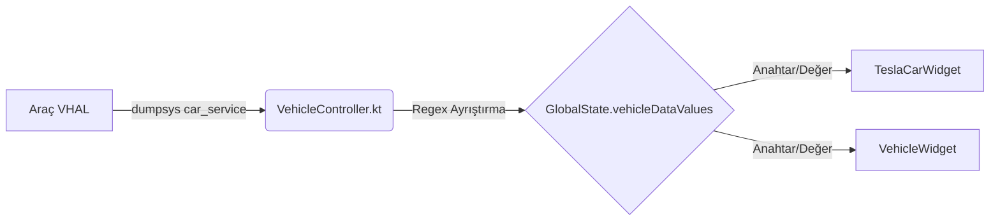

# VHAL VERİ STANDARDI VE SÖZLÜĞÜ (DATA DICTIONARY)

Bu belge, Omoda 5 (Semidrive T19C) aracından `dumpsys` ve `CarPropertyManager` üzerinden okunan verilerin, `GlobalState` içine nasıl haritalandığını (mapping) ve UI (Arayüz) tarafında hangi anahtarlarla tüketileceğini belirleyen **TEK STANDARTTIR.**

UI geliştirmeleri ve arka plan veri akışları **sadece bu belgeye bakılarak** yapılmalıdır.

---

## 1. TEMEL VERİ AKIŞI MİMARİSİ



*   **Veri Kaynağı:** `dumpsys car_service get-property-value <ID> 0`
*   **Toplama Merkezi:** `GlobalState.vehicleDataValues` (MutableStateFlow<Map<String, String>>)
*   **UI Tüketimi:** `val vehicleData by GlobalState.vehicleDataValues.collectAsState()`

---

## 2. KABUL EDİLEN VERİ ANAHTARLARI (KEYS) VE ANLAMLARI

Aşağıdaki tablo, `VehicleController.kt`'nin hangi VHAL kimliğini (Property ID) hangi UI anahtarlarına (Key Alias) dönüştürdüğünü gösterir. 
UI (Widget) tasarımında **yalnızca bu anahtarlar** kullanılmalıdır.

| VHAL Kimliği (ID) | UI Anahtarları (Alias) | Veri Tipi / Format | Açıklama | UI Varsayılan Değeri (Fallback) |
| :--- | :--- | :--- | :--- | :--- |
| `11600207` | `"HIZ"`, `"SPEED"`, `"Araç Hızı"` | String (Örn: `0,6 km/h`) | Aracın gerçek hızı. | `"0 km/h"` veya `"0.0 km/h"` |
| `11600305` | `"DEVİR"`, `"RPM"` | String (Örn: `850 RPM`) | Motor Devri (Sadece Motor Açıkken) | `"0 RPM"` |
| `21402006` | `"VİTES"`, `"GEAR"` | String (Örn: `P`, `R`, `N`, `D`) | Gerçek Vites Pozisyonu | `"P"` |
| `11600307` | `"YAKIT"`, `"FUEL"`, `"Kalan Yakıt"` | String (Örn: `15,0 L`) | Depodaki Kalan Yakıt (Litre) | `"0 L"` |
| `11600703` | `"DIŞ_ISI"`, `"TEMP_EXT"` | String (Örn: `25,0°C`) | Dış Ortam Sıcaklığı | `"--°C"` |
| `11600308` | `"MENZİL"`, `"RANGE"` | String (Örn: `350 km`) | Tahmini Menzil | `"0 km"` |
| `16400b00` | `"KAPI_SOL_ON"`, `"KAPI_SAG_ON"`, vs. | Boolean (`"true"` / `"false"`) | Kapı ve Bagaj Durumları | `"false"` |

---

## 3. UI KODLAMA STANDARDI (WIDGET KURALI)

Herhangi bir Compose Widget'ı yazılırken veriye ulaşmak için zincirleme "Elvis Operatörü" (`?:`) standardı kullanılmalıdır. Bu sayede bir anahtar bulunamazsa diğeri denenir.

**Örnek Standart Kullanım:**
```kotlin
val vehicleData by GlobalState.vehicleDataValues.collectAsState()

// 1. HIZ OKUMA STANDARDI
val speed = vehicleData["HIZ"] ?: vehicleData["SPEED"] ?: vehicleData["11600207"] ?: "0 km/h"

// 2. RPM OKUMA STANDARDI
val rpm = vehicleData["DEVİR"] ?: vehicleData["RPM"] ?: vehicleData["11600305"] ?: "0 RPM"

// 3. VİTES OKUMA STANDARDI
val gear = vehicleData["VİTES"] ?: vehicleData["GEAR"] ?: vehicleData["21402006"] ?: "P"
```

> ⚠️ **UYARI:** Ekrana veri yansımadığında ilk kontrol edilmesi gereken yer, ilgili Widget içerisinde `Text(text = speed)` gibi veriyi gerçekten çizen (render eden) objelerin unutulup unutulmadığıdır. (Bkz: 28 Temmuz 2026 RPM Görünmeme Olayı).

---

## 4. DUMPSYS VE API ÇELİŞKİSİ STANDARDI

- `CarPropertyManager` üzerinden veri okunması `isApiConnected` değişkenini `true` yapsa bile, bu yalnızca hız (speed) verisi için geçerlidir.
- Vites (`21402006`) ve RPM (`11600305`) verileri API güvenlik duvarına takıldığı için **daima `dumpsys` ile kaba kuvvetle okunmak zorundadır.**
- Arka plandaki `pollDumpsysData` döngüsü **asla** API bağlantı durumuna (`isApiConnected`) bağlanamaz, kendi bağımsız yaşam döngüsü (coroutine scope) içinde sonsuza dek dönmelidir.
- Bu mimarinin tarihçesi ve detayları için ana kök dizindeki `DUMPSYS_MIMARISI_VE_TARIHCESI.md` belgesine başvurunuz.
